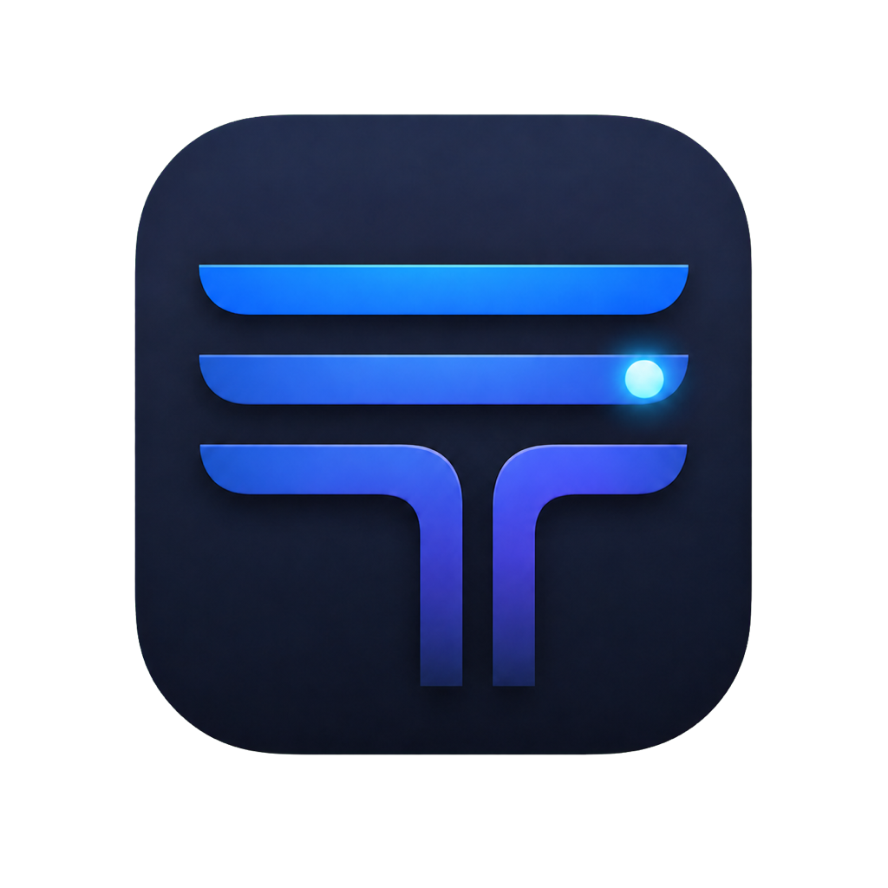

# Trackify Icon and Visual Identity

Status: Initial direction
Last updated: 2026-08-05

## 1. Icon concept

`Trackify` is the accepted V1 working name but remains subject to the public-release name gate in [V1_READINESS.md](./V1_READINESS.md). The current mark remains canonical during V1 development.

The Trackify mark is an abstract activity ledger:

- Three timeline bands represent continuous development history.
- The lower band quietly forms a `T` without drawing a literal letter.
- A single pulse point represents work happening now.
- The compact geometry remains legible at small macOS icon sizes.

The mark deliberately avoids clocks, stopwatches, checkmarks, robots, Git branches, code brackets, gauges, flames, and generic bar-chart imagery. Trackify records development work without presenting itself as a timer or employee-monitoring product.

## 2. App icon

The Dock, Finder, installer, and About surfaces use the rounded-square color icon:



Visual characteristics:

- Deep graphite and midnight-navy base.
- Electric azure-to-indigo activity bands.
- Cool-cyan live pulse.
- Restrained depth and highlights appropriate for a modern native macOS app.
- No text, wordmark, or third-party symbol.

Canonical files:

```text
assets/branding/trackify-app-icon-master.png
assets/branding/trackify-app-icon-1024.png
assets/branding/AppIcon.appiconset/
```

The master is the highest-resolution retained artwork. The 1024-pixel file is the canonical Xcode source. `AppIcon.appiconset` contains the complete macOS 1x and 2x raster matrix and can be moved into the application asset catalog unchanged.

Do not add text, badges, notification counts, provider logos, or source-specific marks to the base icon. Update and health state belongs in the application UI, not permanent icon variants.

## 3. Menu-bar symbol

The menu-bar item uses a separate monochrome template symbol:

```text
assets/branding/trackify-menu-template.svg
```

It preserves the timeline, pulse, and lower `T` silhouette while removing gradients, shadows, and dimensional detail. During app scaffolding it should be exported as a vector PDF or correctly scaled template image, named with the macOS `Template` convention, and rendered as a template so the system controls its color in light, dark, increased-contrast, selected, and disabled states.

The colorful app icon must not be shrunk into the menu bar.

## 4. Small-size behavior

The raster matrix includes native representations from 16 through 1024 pixels. At small sizes:

- Preserve the three-band silhouette and pulse point.
- Prefer clarity over retaining subtle highlights.
- Do not introduce new detail to compensate for scaling.
- If Xcode rendering shows the pulse blooming excessively at 16 or 32 pixels, create an optical small-size variant with a solid pulse and flatter bands rather than applying sharpening filters.

The menu-bar template is evaluated separately because it has different system-rendering requirements from the app icon.

## 5. Production checks

Before the first public release:

- Inspect the icon in Finder list, icon, and gallery views.
- Inspect Dock sizes at standard and magnified scales.
- Inspect the app switcher, Spotlight, About panel, DMG, and Gatekeeper dialog.
- Inspect the menu template in light mode, dark mode, increased contrast, and while selected.
- Verify every asset-catalog slot is populated without Xcode warnings.
- Verify transparent corners and absence of chroma-key fringe.
- Compare the silhouette against nearby installed applications to catch accidental visual similarity.

## 6. Source and licensing

The initial artwork was generated specifically for Trackify using OpenAI's built-in image-generation tool and then locally prepared as transparent PNG assets. It contains no requested third-party logo, trademark, character, or copied application mark.

The icon and brand assets are distributed under the repository's Apache License 2.0. Section 6 of that license does not grant broader rights to project trade names, trademarks, service marks, or product names beyond reasonable and customary description of the work's origin.

## 7. Generation brief

The production direction was generated from this brief:

```text
Create a sleek native macOS icon for Trackify, a passive developer work
ledger. Use three flowing horizontal timeline bands forming a subtle T,
with one luminous live-work pulse. Use a deep graphite and midnight-navy
rounded-square base with electric azure and indigo accents. Keep the
silhouette precise, minimal, original, and recognizable at 16 pixels.
Avoid text, clocks, code brackets, Git branches, robots, gauges, charts,
productivity clichés, excessive glass, and decorative detail.
```
