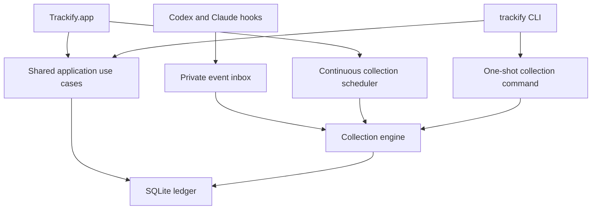
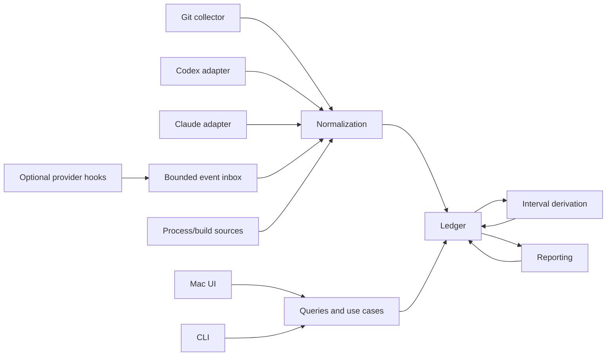

# Trackify System Design

Status: V1 implemented architecture
Last updated: 2026-08-06

## 1. Purpose

This document defines the initial product and technical design for Trackify: a native macOS development-work ledger with a menu bar interface, historical views, and a first-class command-line interface.

The design begins with the user experience and works backward into a shared domain model, collection pipeline, local ledger, reporting system, and implementation plan.

The companion [VISION.md](./VISION.md) explains the product's motivation, principles, and longer-term direction.

The implementation-facing scope and acceptance criteria for the first release are defined in [V1.md](./V1.md). Implementation gates are tracked in [V1_READINESS.md](./V1_READINESS.md). Privacy and data handling are defined in [PRIVACY_SECURITY.md](./PRIVACY_SECURITY.md). Release delivery and safe application updates are defined in [UPDATES.md](./UPDATES.md).

Detailed interface, repository discovery, conversation-source compatibility, report providers, and distribution behavior are defined in [UI.md](./UI.md), [REPOSITORY_DISCOVERY.md](./REPOSITORY_DISCOVERY.md), [SOURCE_COMPATIBILITY.md](./SOURCE_COMPATIBILITY.md), [LLM_PROVIDERS.md](./LLM_PROVIDERS.md), and [INSTALLATION.md](./INSTALLATION.md).

## 2. Design goals

Trackify must:

- Provide an immediate, useful view of current and recent development work.
- Track Git repositories and supported local Codex and Claude conversations.
- Recognize meaningful agent work even when the computer has no keyboard or mouse activity.
- Distinguish completed, unfinished, investigative, waiting, and inactive periods.
- Present simple statistics and moving-average comparisons without an opaque productivity formula.
- Generate concise hourly and daily verbal reports grounded in observable evidence.
- Preserve a searchable local history that can be queried by both people and agents.
- Expose all important queries through a stable CLI with structured output.
- Support deterministic historical backfill and accelerated time simulation.
- Keep source-specific parsing behind replaceable adapters.
- Remain small enough to build and reason about as a focused native application.

## 3. Non-goals

The initial system will not attempt to:

- Determine whether the user was objectively productive.
- Infer project-management tasks or issue status without explicit evidence.
- Treat every commit as a completed feature.
- Monitor keystrokes or record screen contents.
- Replace Git, an issue tracker, or a time-billing platform.
- Provide team surveillance, management dashboards, or employee scoring.
- Use embeddings or a vector database before full-text search proves insufficient.
- Support every editor, agent, or source in the first release.
- Run a separate background daemon before the menu-bar process proves insufficient.

## 4. Product experience

### 4.1 Menu bar

The menu bar is the primary daily interface. It should answer:

1. What is happening now?
2. What has happened today?
3. What is the latest meaningful outcome or unfinished state?

The collapsed menu bar item should remain compact. A representative format is:

```text
Today  ·  4 active h  ·  6 commits  ·  ↑18%
```

The popover should contain:

```text
LATEST EVIDENCE
Codex message in trackify                     8m ago

TODAY
Active hours       4             ↑18%
LLM turns          7
Commits            6
Lines changed      +842 / −317
Files              24
Repositories       3

09  10  11  12  13  14  15  16
▂   ▆   █   ·   ▃   ▇   ▅   ▂

LATEST
Continued implementing repository discovery. The scanner
remained uncommitted and in progress.

[Open Trackify]                              [Pause] [More]
```

The popover also needs lightweight controls:

- Open the main window.
- Pause or resume collection.
- Open one overflow menu for Sync now, Settings, update check, and Quit.

Collection state is a calm colored capsule rather than an indeterminate spinner. The hourly chart labels six-hour intervals. Report copy remains available in the full Activity ledger, where the surrounding evidence is visible.

Optional hooks may add a separate live indicator for recognized agents. That indicator is telemetry only: it does not change active hours, historical comparisons, or whether a report period contains core evidence.

### 4.2 Main application

The main window contains three primary destinations. Capabilities are grouped by user intent so reports, calendar selection, and search do not duplicate the chronological ledger.

#### Overview

- Evidence-backed totals for today, 7 days, and 30 days.
- Moving-average context, daily trend, and a clickable six-week heatmap.
- Explicit selected date with current-day marker and direct date navigation.
- Reports and repository focus for the selected period.

#### Activity

- Reverse-chronological reports, commits, conversations, working-tree changes, and test outcomes.
- Inline search and type filters over one bounded ledger query.
- Visually distinct report cards with state, evidence count, provider metadata, and copy action.
- Concrete evidence remains visible around narrative interpretation.

#### Projects

- Discovered and configured repositories.
- Latest known working-copy location and observation time.
- Deterministic grouping by configured discovery root and relative folder path.
- Complete scrollable catalog kept outside the compact menu and sidebar.
- Repository-scoped history remains available through shared CLI context and timeline queries.

### 4.3 Settings

Settings remains an observational native surface: launch at login, pause/resume, provider health, automatic-update preference, installation origin, update check, and configured roots. Agent-driven bootstrap and the CLI own roots, provider selection, backfill, private export, report deletion, and detailed diagnostics so V1 has one mutation path rather than parallel app and CLI forms.
- Source and collector health.

## 5. CLI design

The `trackify` CLI is a product interface, not a debugging accessory. It must expose the same application queries used by the macOS UI.

### 5.1 Initial commands

```bash
trackify status
trackify today
trackify day 2026-08-05
trackify timeline --since 7d
trackify search "repository discovery"
trackify context --repo current --since 14d
trackify context --today --all --max-characters 12000
trackify repos
trackify sessions
trackify report --today
trackify providers list
trackify providers status
trackify providers use <codex|claude>
trackify collect
trackify backfill --from 2026-08-03 --to 2026-08-05
trackify doctor
trackify bootstrap inspect --json
trackify bootstrap apply --provider auto --backfill-evidence all --backfill-reports 14d --launch
```

Supporting inspection commands:

```bash
trackify show report <id> [--evidence-limit <count>]
trackify show session <id> [--message-limit <count>]
trackify show commit <id>
```

Likely later commands:

```bash
trackify data export ~/Desktop/trackify-ledger.sqlite
trackify report --from 2026-08-01 --to 2026-08-05 --copy
trackify config get
trackify config set <key> <value>
trackify simulate --scenario foundation --speed instant --days 2
```

### 5.2 Agent-oriented context

`trackify context` provides a compact reconstruction of project history:

```bash
trackify context \
  --repo current \
  --since 14d \
  --max-characters 12000
```

Representative output:

```text
Project: trackify
Period: 2026-07-23 through 2026-08-05

Recent work:
- Implemented repository discovery and Git metadata scanning.
- Began the SQLite activity ledger; schema remains in progress.
- Chose separate work-session and agent-runtime measurements.

Current state:
- 7 modified files
- No commit since e815ba2
- Latest Codex session is still running
- Storage implementation appears unfinished
```

The default context output favors current repository state, recent commits, and bounded user/assistant evidence. A daily portfolio query gives an agent one useful ledger without requiring it to discover and join every project itself:

```bash
trackify context --today --all --max-characters 12000
trackify context --today --all --max-characters 12000 --json
```

### 5.3 Output contract

- Human-readable output is the default.
- Every read/query command supports `--json`.
- JSON output uses versioned, documented structures.
- The full encoded context JSON, including its envelope and trailing newline, stays within `--max-characters`; it does not duplicate the rendered context as an unbounded object graph.
- Output contains stable record identifiers for follow-up queries.
- Commands do not emit ANSI formatting when output is redirected.
- Diagnostics go to standard error; requested data goes to standard output.
- Exit codes distinguish success, invalid usage, unavailable data, collection errors, and internal failures.
- Repository-scoped commands infer the repository from the current directory when `--repo current` is used.
- Session inspection selects the latest bounded tail and orders it chronologically. Report inspection returns evidence counts but includes evidence identifiers only up to an explicit limit.

## 6. Architecture

### 6.1 Process model

The initial version uses two executables and one shared library architecture:



- `Trackify.app` launches at login and owns continuous collection and scheduled report generation.
- The CLI links the same Swift packages and executes the same queries and use cases.
- `trackify collect` runs a safe one-shot reconciliation when immediate freshness is required.
- SQLite uses WAL mode for concurrent readers and controlled writes.
- A database-backed collection lease prevents duplicate concurrent imports.
- The app writes a lightweight heartbeat so `trackify status` can report whether continuous collection is healthy.

A separate helper or daemon is deliberately deferred. If the application later needs collection to survive the menu-bar process being explicitly closed, the collection engine can be hosted behind a local service without changing the domain model or ledger.

#### Local app control

V1 deliberately does not add an IPC server. Read-only CLI commands query the shared ledger directly, and bounded mutating commands acquire the same database-backed lease used by the app. Pause and update actions remain app-owned. A versioned local control endpoint can be added when a concrete agent-owned app-control workflow justifies the extra process boundary.

### 6.2 Component boundaries



The key boundaries are:

- **Domain:** source-independent types and rules.
- **Store:** database schema, migrations, transactions, and search.
- **Engine:** collectors, normalization, bounded activity queries, reporting, and application use cases.
- **Presentation:** SwiftUI and CLI formatting only.

### 6.3 Proposed repository structure

```text
trackify/
├── Package.swift
├── Sources/
│   ├── TrackifyDomain/
│   ├── TrackifyStore/
│   ├── TrackifyEngine/
│   └── TrackifyCLI/
├── Apps/
│   └── TrackifyMac/
├── Tests/
│   ├── TrackifyStoreTests/
│   ├── TrackifyEngineTests/
│   └── TrackifyCLITests/
└── docs/
```

Initial source adapters and reporting implementations live as folders inside `TrackifyEngine`. They should become separate package targets only when independent dependencies or compilation boundaries justify the split. Premature target proliferation would add ceremony without improving the model.

### 6.4 Technology choices

- Swift and SwiftUI for the native application.
- Swift Package Manager for domain, store, engine, and CLI code.
- SQLite as the durable local ledger.
- GRDB for migrations, typed queries, transactions, WAL, and full-text search.
- The system `git` executable for read-only Git inspection rather than an embedded Git implementation.
- Replaceable summarizer adapters rather than model-provider calls embedded in reporting logic.

### 6.5 Time and scheduling boundary

Time-sensitive collection and simulation logic receives an injected clock abstraction that provides:

- The current wall-clock instant.
- The current timezone and calendar context when required.
- Explicit cutoffs for deterministic derivation and reporting.

Production collection uses the real system clock. Tests and simulations use a manually advanced virtual clock. The app owns one small Task-based cadence loop; the report scheduler itself is a deterministic period policy that tests call at arbitrary virtual instants without sleeping.

Collectors also receive an explicit collection range or cutoff rather than assuming that “now” is the only relevant time. This makes live collection, historical backfill, and simulation different executions of the same pipeline instead of separate implementations.

Code that measures process duration may use a monotonic clock internally, but persisted evidence always records wall-clock instants. This prevents system clock adjustments from corrupting run durations while preserving correct calendar placement.

## 7. Ledger design

### 7.1 Data layers

The ledger separates three kinds of data:

1. **Imported evidence:** source messages, Git commits, working-tree observations, run lifecycles, and process results.
2. **Normalized activity:** source-independent events that describe what was observed.
3. **Derived views:** query-time period state, hourly/daily activity snapshots, reports, comparisons, and search indexes.

Derived data can be regenerated. Imported evidence and normalized source identity provide the durable audit trail.

### 7.2 Initial tables

The initial schema is expected to include:

- `repositories`
- `discovery_roots`
- `working_copies`
- `working_copy_locations`
- `sessions`
- `session_messages`
- `commits`
- `working_tree_snapshots`
- `process_runs`
- `events`
- `work_intervals` (reserved for optional live telemetry; not used by core historical metrics)
- `reports`
- `hourly_rollups` (reserved rebuildable cache; not authoritative in the minimal V1)
- `daily_rollups` (reserved rebuildable cache; not authoritative in the minimal V1)
- `collector_cursors`
- `collector_leases`
- `service_heartbeats`
- source-observation provenance sufficient to reconcile hook and cache evidence
- one FTS document index for reports, commits, repositories/working-copy paths, and session messages

Exact columns are fixed by the first migration. All time-bearing records store UTC instants. The minimal V1 calculates batched hourly and local-day snapshots directly from core events; the reserved rollup tables allow a later performance cache without changing the app or CLI query surface.

### 7.3 Event shape

Normalized events use a common envelope:

```json
{
  "id": "event-id",
  "occurredAt": "2026-08-05T08:42:13Z",
  "observedAt": "2026-08-05T08:42:15Z",
  "source": "codex",
  "ingestionPath": "hook",
  "sourceEvidenceId": "source-evidence-id",
  "kind": "agent.run.started",
  "repositoryId": "repo-id",
  "sessionId": "session-id",
  "payload": {
    "task": "Implement repository discovery"
  },
  "schemaVersion": 1
}
```

Representative event kinds:

```text
repository.discovered
repository.changed
git.commit.observed
git.working_tree.changed
agent.session.observed
agent.message.observed
agent.run.started
agent.run.waiting
agent.run.finished
build.started
build.finished
test.finished
```

Payloads remain small and source-independent when possible. Large raw source content belongs in its source-specific table rather than being duplicated into event payloads.

### 7.4 Identity and idempotency

Every imported record needs:

- A stable Trackify identifier.
- Source type and source-specific external identifier.
- Content hash or source revision marker.
- Occurrence and observation timestamps.
- Collector version.
- Ingestion path and a source-evidence fingerprint when the same fact may arrive through hooks and cache reconciliation.

Collectors upsert or append revisions based on stable source identity. Repeated reconciliation must produce the same ledger rather than duplicate events.

## 8. Collection system

### 8.1 Collector contract

Each collector implements the same conceptual lifecycle:

```text
discover sources
read from last cursor
normalize records
write evidence and events transactionally
advance cursor
report health
```

Collectors are read-only toward their source systems. They must tolerate unavailable files, partially written records, source format changes, and late-arriving data.

### 8.2 Git collector

Repository discovery begins from configured roots rather than repeatedly crawling the entire filesystem. The initial setup proposes common development roots and lets the user add or exclude locations.

Each root has a display label, such as Work or Personal. Working copies are grouped deterministically by root and relative folder hierarchy. Paths and root membership are stored as time-bounded location history rather than repository identity. The complete discovery and grouping contract is defined in [REPOSITORY_DISCOVERY.md](./REPOSITORY_DISCOVERY.md).

The Git collector uses stable porcelain and machine-readable commands to observe:

- Repository identity and canonical path.
- Current branch and HEAD.
- New commits and commit metadata.
- Working-tree status.
- Changed file paths.
- Added, deleted, and net lines.
- Renames where available.
- Clean or dirty state at observation boundaries.

Git is treated as evidence, not a task system. A clean tree or commit does not automatically mean a feature was completed.

### 8.3 Codex and Claude adapters

Conversation sources implement a shared adapter boundary while retaining source-specific parsers.

```text
ConversationSource
├── CodexConversationSource
└── ClaudeConversationSource
```

Each adapter is responsible for:

- Discovering supported local cache locations or accepting configured locations.
- Parsing sessions, messages, tool activity, and run lifecycle information when present.
- Associating sessions with repositories using explicit metadata first and path evidence second.
- Retaining stable source identifiers and content hashes.
- Reporting unsupported or changed formats without corrupting existing history.

Trackify stores normalized session and message records so the ledger remains searchable even if the provider later rotates its cache. Source paths and hashes are retained for traceability.

Adapter fixtures from real, redacted sessions are required. Parser compatibility must be tested independently from the rest of the engine.

#### Optional live hook bridge

Codex and Claude both expose lifecycle hooks. V1 provides a provider-neutral normalized command that a user, managed configuration, or later provider-specific adapter can target. It does not parse raw hook payloads or edit provider configuration. Hooks improve latency and state precision; they never replace persisted conversation-cache ingestion.

```text
provider hook
→ provider-specific mapping outside the V1 core
→ trackify integrations emit <codex|claude> --session … --turn … --phase …
→ validate the normalized allowlist and 64 KiB envelope limit
→ append one complete record under a lock to the private event inbox
→ return without waiting for the app, Git, SQLite, network, or a model
→ app drains, normalizes, and reconciles the envelope
```

The bridge accepts only structural evidence needed for work tracking: provider, nonempty session and turn identifiers, timestamp, optional working-directory association, and one normalized lifecycle phase. Prompts, message bodies, thinking, tool arguments, tool results, environment data, and arbitrary hook payloads are not command inputs.

Provider configuration should invoke the bridge as best-effort telemetry and must not make an agent run depend on its success. The command performs no network request, provider invocation, Git inspection, database migration, or long-held lock. Concurrent calls append complete records under an exclusive file lock beneath the user-private Trackify data tree; the app owns incremental draining and ledger writes.

Provider-hook installation is deliberately outside the V1 core. Codex trust review, provider policy, disabled hooks, unsupported versions, or a stopped Trackify app may prevent live delivery. The CLI reports whether its local inbox has received records, while persisted-cache reconciliation remains authoritative for eventual completeness.

The same normalized fact may be observed first through a hook and later through a persisted cache record. Source adapters retain both observation provenance and one canonical identity, using provider identifiers when available and a deterministic fingerprint otherwise. Dual-path observation may improve confidence or timestamps but must not create duplicate sessions, messages, or metrics.

### 8.4 Live observation and reconciliation

Live filesystem observation provides responsiveness, but it is not the sole source of correctness. The app also performs periodic reconciliation scans using collector cursors. This ensures that events missed during sleep, restart, crash, or source downtime are eventually imported.

Collection follows an at-least-once observation model with idempotent writes.

### 8.5 Historical backfill

Backfill imports real evidence whose occurrence time is in the past. It uses the same collectors, normalization rules, and transactions as live collection.

```bash
trackify backfill \
  --from 2026-08-03T00:00:00 \
  --to 2026-08-05T23:59:59 \
  --sources git,codex,claude
```

Backfill behavior:

- Collectors query or scan the requested historical range.
- Evidence and deterministic statistics may be imported for the full available range without provider calls.
- Initial model-generated reports default to a separate recent window and older reports remain available on demand.
- Imported records retain their original `occurredAt` value and record the current import time as `observedAt`.
- Stable source identity and content hashes make repeated backfills safe.
- Activity snapshots are queried directly from durable core evidence and reports can be regenerated explicitly.
- Recalculation uses explicit local calendar boundaries and a cutoff, so the same evidence produces the same result during live collection, backfill, and replay.
- Report generation can be enabled, disabled, or deferred to avoid unnecessary model calls during large imports.
- Planning reports history footprint plus conservative provider-call and input-token ceilings before report generation.

Backfill never manufactures missing historical activity. If a source no longer contains the relevant evidence, the ledger records no activity for that source and period.

### 8.6 Simulation and replay

Simulation exercises the entire system over synthetic or recorded fixture evidence using a virtual clock.

```bash
trackify simulate \
  --scenario two-day-development \
  --start 2026-08-03T08:00:00+02:00 \
  --speed instant
```

A scenario can describe:

- Repository discovery and file changes.
- Commits and working-tree snapshots.
- Agent runs, messages, waiting periods, failures, and completion.
- Parallel agents and overlapping builds.
- Quiet hours and explicit no-activity periods.
- Timezone or day-boundary transitions.

The simulator advances directly to the next event. Two days can therefore be processed in seconds while exercising the real evidence ingestion, active-evidence-hour counting, LLM-turn normalization, commit metrics, period states, and activity queries. By default its ledger is deleted after validation; `--output-data-root` preserves it for ordinary UI and CLI inspection.

Scheduled report recovery is separately deterministic: on each app-owned collection cycle it scans one bounded seven-day event window, fills only missing active hour/day periods plus the normal previous hour/day, and allows model calls only for the newest hour/day. Older catch-up summaries are deterministic and token-free.

Simulation must use a separate temporary or explicitly named database. It must refuse to write synthetic evidence into the user's production ledger. The default test summarizer is deterministic and fixture-backed; live model calls require an explicit opt-in.

The same replay runner can execute captured, redacted event fixtures. This provides reproducible regression tests for bugs that only appear across hourly or daily boundaries.

## 9. Evidence-time model

### 9.1 Definitions

Trackify's primary historical time metric is **active evidence hours**: the number of local clock hours containing at least one core evidence record. It is deliberately a count of covered hours, not a duration estimate.

The **observed window** is the first through last evidence timestamp in the selected period. It shows chronology without claiming continuous work between the endpoints.

Core evidence consists of reachable commits, normalized Codex or Claude messages, real post-baseline working-tree transitions, and build/test records. File modification dates, machine idleness, inferred gaps, and lifecycle hooks do not create historical activity.

### 9.2 Optional live telemetry

Explicit agent or process lifecycle events may support a separate live indicator and diagnostic interval view. Such telemetry may be absent, duplicated, interrupted, or provider-specific. It is therefore rebuildable and optional, and never changes core evidence hours, comparisons, or historical reports.

### 9.3 Attribution

- Evidence retains its source timestamp and stable identity.
- Repository attribution is included only when supported by a direct repository or session association.
- Multiple records within the same local clock hour count as one active hour.
- A normalized user message counts as an LLM turn; assistant and tool messages remain conversation-message evidence.
- Hooks can improve immediacy without becoming a backfill authority.

### 9.4 No evidence

If an hour has no core evidence, its state is `no_activity`. Trackify does not ask a language model or heuristic to fill that gap with a narrative or invented duration.

## 10. Statistics and comparisons

Initial statistics are intentionally direct:

- Active evidence hours.
- First and last evidence timestamps.
- LLM turns and conversation messages.
- Commits.
- Added, deleted, and net lines.
- Files changed.
- Repositories touched.
- Sessions represented by durable messages.
- Hourly evidence distribution.

Each metric can be compared with a trailing moving average. The initial default is 14 active days, excluding days with no detected development work.

For a live day, pace comparisons should compare the current total with historical totals at approximately the same local time of day. Completed-day views compare full-day totals. The UI shows the underlying metric and percentage rather than blending unrelated measurements into a composite score.

## 11. Reporting system

### 11.1 Evidence packet

Before requesting a language-model summary, Trackify constructs a deterministic evidence packet containing only the relevant period:

- Repositories involved.
- Active evidence hours and the first/last observed timestamps.
- Commits.
- Changed files and diff statistics.
- Working-tree state at the start and end.
- Relevant normalized conversation messages with typed user or assistant roles, preserving the distinction between requested intent and reported progress.
- Build and test outcomes.

The evidence packet is reproducible from ledger identifiers and inspectable
through a safe local preview. The transient packet is not stored. Provider-visible
events, repositories, sessions, and prior hourly reports use short local aliases;
validated aliases are mapped back to stable evidence identifiers before the
report is persisted.

Hourly compilation selects at most 30 events. Daily compilation selects at most
12 day-level events and adds active hourly report digests so morning work cannot
be displaced by a busy evening. The compiled evidence budget is 20 KiB. Selection
metadata records context coverage and omitted evidence by kind.

Deterministic and model-generated summaries interpret user messages as goals, questions, and decisions; assistant messages as progress claims or implementation context; and Git, tests, working-tree transitions, and the final period state as concrete outcome evidence. Intent and outcome may be paired only within a supported session or repository context, preventing unrelated parallel work from becoming one fabricated narrative. This role distinction is also preserved in Activity and project history.

### 11.2 Report structure

Reports are stored as structured records:

```json
{
  "id": "report-id",
  "periodStart": "2026-08-05T09:00:00+02:00",
  "periodEnd": "2026-08-05T10:00:00+02:00",
  "state": "in_progress",
  "summary": "Continued implementing repository discovery...",
  "topics": ["repository discovery", "Git metadata"],
  "repositoryIds": ["repo-id"],
  "evidenceIds": ["stable-evidence-1", "stable-evidence-2"],
  "generator": {
    "provider": "codex",
    "model": "configured-model",
    "promptVersion": 1
  }
}
```

Initial states:

```text
in_progress
completed
investigating
waiting
observed
no_activity
```

The state is derived from ledger evidence before prose generation. The summarizer writes a concise narrative constrained by that evidence. It should prefer cautious language such as “started,” “continued,” “investigated,” and “remained in progress” unless completion is explicitly supported.

### 11.3 Report lifecycle

- Hourly reports are generated after the period closes, with an optional short delay for late evidence.
- The current hour may show a provisional deterministic preview.
- Late-arriving evidence can produce a new report revision.
- Previous revisions remain traceable, while normal UI and CLI queries return the latest valid revision.
- Daily reports summarize hourly reports and day-level evidence rather than sending the entire raw day transcript again.
- `no_activity` reports are deterministic and require no model call.

### 11.4 Summarizer boundary

Reporting depends on a small `SummaryProvider` interface. V1 implements Codex CLI and Claude Code CLI providers behind the same structured report contract. The reporting engine does not depend directly on either CLI, model, or authentication mechanism.

Provider selection is independent from conversation collection: both session sources may be imported while either provider generates reports. Trackify uses non-persistent, read-only, tool-free invocations so internal summarization cannot modify repositories or re-enter the ledger as work evidence. The complete invocation, model, authentication, retry, and feedback-loop contract is defined in [LLM_PROVIDERS.md](./LLM_PROVIDERS.md).

## 12. Search and retrieval

SQLite FTS indexes:

- Report summaries and topics.
- Commit messages and hashes.
- Repository names, remote identities, and working-copy paths.
- Session messages.
- Repository names and aliases.

Search results include source type, timestamp, repository, a highlighted excerpt, and the stable record identifier.

The agent-oriented `context` query combines:

- Recent daily and hourly reports.
- Current working-tree state.
- Recent commits.
- Active or unfinished sessions.
- Relevant search results when a query is supplied.

It enforces an output budget by preferring recent summaries and state over raw messages. Raw evidence is included only when requested or when summaries are unavailable.

## 13. Reliability and recovery

Trackify must expect source files to be incomplete, delayed, moved, or changed by external applications.

The system therefore uses:

- Transactional imports.
- Per-source cursors.
- Stable identity and content hashes.
- Idempotent reconciliation.
- Database migrations with rollback-safe development practices.
- Collector health records and last-success timestamps.
- A `trackify doctor` command that checks the database, configured roots, source availability, permissions, app heartbeat, and collector errors.
- Regeneration of reports from durable evidence; hourly/day snapshots and moving averages are deterministic queries over that evidence.

A collector failure must not prevent unrelated collectors or historical queries from working.

Activity snapshots are pure range queries over immutable evidence, so they do not require a rebuild step. Explicit report regeneration creates a new traceable revision without re-importing or modifying source evidence. This separation allows reporting and activity-query algorithms to evolve while preserving the historical ledger.

## 14. Local data and access

The ledger is local and user-owned. The initial distribution is expected to be a signed, notarized application outside the Mac App Store because broad repository and local cache access conflicts with a tightly sandboxed experience.

The app and CLI are distributed together through signed and notarized GitHub Release artifacts, a signed installation manifest, a Sparkle appcast, and a stable agent-readable installation protocol. Direct installations use Sparkle 2 for verified in-app replacement and relaunch. Homebrew and managed installations retain one external update authority. Codex or Claude can perform every safe mechanical installation step; provider login and macOS privacy approval remain explicit user actions.

Before applying configuration, deterministic local inspection returns a bounded manifest of provider health, candidate roots, repository counts, and backfill estimates. The installer agent combines that manifest with reliable conversation knowledge, recommends primary groups and separate evidence/report history windows, and asks one consolidated confirmation question. Raw repository contents and transcripts are not sent to the installer agent for setup classification. The complete distribution contract is defined in [INSTALLATION.md](./INSTALLATION.md).

The database, configuration, private logs, migration backups, and runtime files live beneath `~/Library/Application Support/Trackify/` with user-only permissions. Direct releases use Developer ID signing, hardened runtime, and notarization. Final bundle identifiers, Team ID, and signing keys are supplied through centralized build and protected release configuration rather than domain code.

The app should:

- Avoid storing full source-code diffs by default when file paths, statistics, commits, and conversation evidence are sufficient.
- Store imported conversation content locally for durable search, with clear deletion and exclusion controls.
- Send only bounded evidence packets to the configured summarizer.
- Never upload raw history merely to calculate local statistics.
- Provide explicit export and deletion operations.

## 15. Testing strategy

### Domain and activity tests

- Multiple evidence records collapsing into one local active hour.
- Parallel conversations without double-counting wall-clock hours.
- Lifecycle-only periods producing no core historical activity.
- Periods containing durable messages or commits without any explicit run lifecycle.
- True no-activity hours.
- Work crossing hourly, daily, and timezone boundaries.
- All time-dependent behavior under a manually advanced virtual clock.

### Collector contract tests

- Repeated imports remain idempotent.
- Partially written source data does not corrupt the ledger.
- Cursor advancement occurs only after a successful transaction.
- A changed source record creates the correct revision or update.
- One broken source does not block other collectors.

### Git fixtures

- Clean and dirty repositories.
- Untracked files, renames, binary files, merges, and detached HEAD.
- Commits discovered after the application was offline.
- Worktrees and nested repository layouts.

### Conversation fixtures

- Redacted Codex and Claude sessions representing supported format versions.
- In-progress, completed, failed, and interrupted sessions.
- Missing repository metadata and path-based association.
- Cache rotation and duplicate discovery.
- Sanitized lifecycle-hook envelopes for each supported provider capability set.
- The same lifecycle fact arriving hook-first, cache-first, duplicated, delayed, and out of order.
- Disabled, untrusted, malformed, oversized, and unsupported hook behavior falling back to cache reconciliation.
- Concurrent hook delivery proving the bridge remains bounded and cannot block the provider session.

### Reporting tests

- No-activity periods skip model generation.
- Evidence identifiers in reports exist and fall within the relevant context.
- The provider cannot override locally derived in-progress, waiting, failed, or inactive state; prompts require the narrative to preserve that state, while evidence-link validation prevents fabricated support.
- Late evidence creates a new revision.
- Daily reports remain consistent with their hourly evidence.
- Two simulated days produce the same reports and activity snapshots across repeated runs.

### Backfill and simulation tests

- Repeating the same backfill produces no duplicate evidence.
- Late evidence changes only queries and report revisions for the affected range.
- Backfill preserves original occurrence time and records a distinct observation time.
- An instant-speed simulation triggers every expected hourly and daily boundary.
- Synthetic scenarios cannot open the production database.
- Deterministic summarizer fixtures make simulation output reproducible.
- Rebuild changes derived data without modifying imported evidence.

### CLI contract tests

- Human and JSON output.
- Stable field naming and schema versions.
- Exit codes and standard output/error separation.
- Current-directory repository inference.
- Output token budgeting for `context`.

## 16. Implementation plan

### Milestone 1: Headless ledger

- Scaffold the Swift package and test targets.
- Define domain types and identifiers.
- Define injected wall-clock, explicit-cutoff, scheduled-period, and collection-range boundaries.
- Add GRDB, the first migration, and database configuration.
- Implement collector cursors, leases, and heartbeats.
- Add `trackify doctor` and basic `trackify status`.
- Add a minimal virtual-time scenario runner against an isolated database.

Outcome: a reliable local database and CLI foundation.

### Milestone 2: Git history

- Configure repository roots and exclusions.
- Discover repositories.
- Import commits and working-tree snapshots.
- Calculate file and line statistics.
- Add `repos`, `today`, `timeline`, and initial search commands.
- Add range-based Git backfill and deterministic range-query commands.

Outcome: Trackify is already useful as a local Git work ledger.

### Milestone 3: Native daily experience

- Create the menu bar application.
- Add launch-at-login behavior.
- Display current collector health and live daily statistics.
- Add Today and basic Day views.
- Add refresh, pause, copy, and settings controls.

Outcome: the ledger becomes continuously visible and collectible.

### Milestone 4: AI conversation sources

- Implement the Codex adapter with fixtures.
- Implement the Claude adapter with fixtures.
- Normalize sessions, messages, and available run lifecycles.
- Add the optional bounded hook bridge and private event inbox for both providers.
- Reconcile hook and cache observations through one idempotent source-evidence identity.
- Add session search and repository association.

Outcome: Git and agent activity form one searchable history.

### Milestone 5: Evidence time and reports

- Count active evidence hours, LLM turns, messages, and observed windows from durable records.
- Keep lifecycle intervals as optional telemetry outside core activity.
- Build batched hourly and daily activity-query projections.
- Assemble inspectable evidence packets.
- Implement the summarizer boundary and both Codex CLI and Claude Code CLI providers.
- Add provider health, selection, non-persistent invocation, and feedback-loop prevention.
- Add report revisions and unfinished-work language constraints.
- Implement `report` and `context` CLI commands.

Outcome: Trackify explains the work rather than only counting it.

### Milestone 6: Historical product

- Add the calendar, repository history, and complete day detail.
- Add moving-average comparisons.
- Complete full-text search and filters.
- Add export, deletion, and data-health tools.

Outcome: Trackify provides a dependable long-term development history.

## 17. Decisions made

- Native Swift/SwiftUI macOS application.
- Shared Swift packages used by both GUI and CLI.
- SQLite/GRDB local ledger.
- Menu-bar process owns continuous collection initially; no separate daemon.
- System Git CLI for repository inspection.
- Event-backed derived activity snapshots and reports.
- Active evidence hours are coverage counts, not duration estimates.
- Optional lifecycle telemetry and machine idle state do not alter historical activity.
- Full-text search before semantic search.
- No composite productivity score in the initial product.
- No-activity reports are deterministic and do not use a language model.
- V1 supports both Codex CLI and Claude Code CLI as report providers.
- Provider report runs are read-only, tool-free, and non-persistent.
- Installation is agent-drivable from a stable signed-release protocol.
- Guided setup uses bounded local inspection and separates broad evidence import from recent model-report generation.
- Discovery roots and relative paths provide automatic repository grouping in V1.
- Collection time uses injected clocks; derivation/reporting use explicit cutoffs and deterministic period policy; only the app owns real waiting.
- Simulation always uses an isolated ledger and deterministic summarizer by default.
- Live collection and historical backfill share the same idempotent collector pipeline.
- Direct application updates use Sparkle 2 with signed, notarized GitHub Release artifacts.
- The app and bundled CLI are one versioned release unit.
- Installation origin determines one update authority; Trackify does not replace Homebrew- or MDM-owned copies.
- The provisional platform baseline is macOS 14 or later with Universal 2 release artifacts.
- Direct distribution uses a non-App-Sandbox Developer ID application with hardened runtime.
- The canonical data root is `~/Library/Application Support/Trackify/` with user-only permissions.
- V1 has no Trackify analytics or automatic crash-report upload.
- Provider evidence packets are bounded and deterministically redacted before invocation.
- App-owned control operations use a local user-only Unix socket; no daemon is required.

## 18. Open decisions

These should be resolved with prototypes or real captured data rather than speculation:

- Exact supported Codex and Claude cache formats and lifecycle signals.
- How precisely to detect active local build and test processes without editor-specific integration.
- Whether raw session tool payloads should be retained or selectively normalized.
- Minimum supported Codex and Claude CLI versions after compatibility prototypes.
- Whether an optional nonstandard workday boundary is required in the first release.
- When repository grouping into higher-level projects becomes necessary.
- The fixture scenario file format and whether it should be public API in the first release.

None of these open decisions require changing the central architecture: a shared application layer over a local evidence ledger with replaceable collectors and summarizers.

## 19. Goal 3 canonical summary architecture

Goal 3 supersedes the earlier use of `WorkReport` as both an automatic
interpretation and a user-facing output. The current one-way dependency is:

```text
canonical evidence -> WorkSummary -> ReportArtifact -> destination
```

`SummaryCoverageCompiler` is the only leaf-summary input compiler. It resolves
message aliases, filters unreachable commits and internal control envelopes,
redacts secrets, preserves full user and commit text across ordered fragments,
bounds assistant text with explicit metadata, and fails closed unless every
eligible evidence identity is covered. It groups active evidence into stable
closed half-hour slots; quiet slots do not trigger per-slot queries or model
calls.

`SummaryCoordinator` creates immutable segment revisions and composes complete
segment children into current and day parents. Identity is a source
fingerprint, not wall-clock refresh frequency. Refreshing twice inside one
half-hour boundary is idempotent; late evidence creates a new leaf revision and
therefore new parents. Provider failure and budget exhaustion produce the same
structured local content without blocking collection.

`WorkSummary` stores a full narrative, a separately authored compact narrative,
project names, project sections, intent, outcomes, open work, blockers, topics,
statistics, coverage, child links, evidence links, and provider provenance.
Model output is repaired with deterministic project sections if a provider
omits an evidenced project. Normal queries and search expose the newest exact-
period revision while stable IDs keep earlier revisions auditable.

Configurable reports compile complete day or segment summaries before selecting
direct evidence anchors. They cannot feed back into summaries. The legacy
`reports` table remains read-only compatibility data through one rollback
window; runtime Overview, menu, Activity, search, and summary CLI surfaces use
`work_summaries`.
