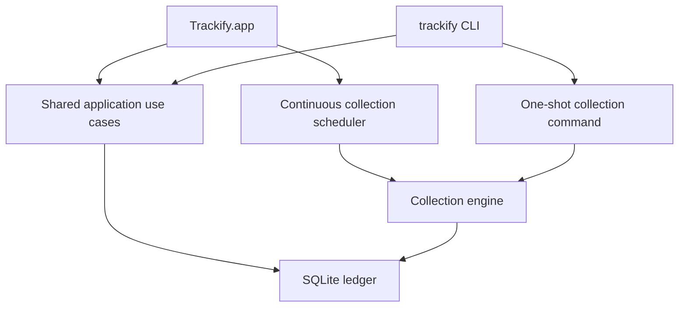
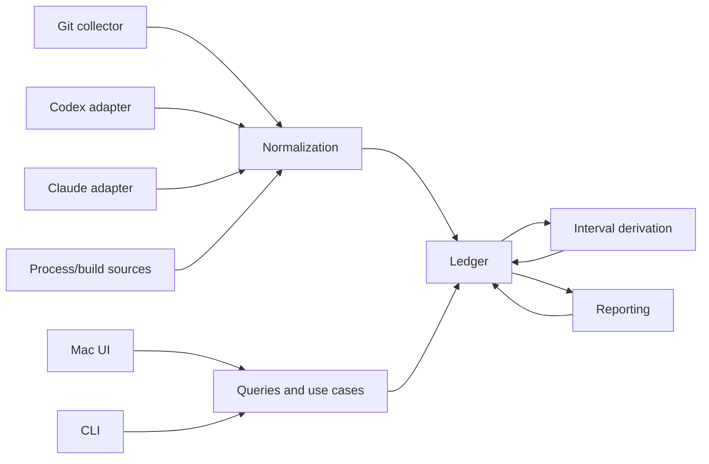

# Trackify System Design

Status: Proposed
Last updated: 2026-08-05

## 1. Purpose

This document defines the initial product and technical design for Trackify: a native macOS development-work ledger with a menu bar interface, historical views, and a first-class command-line interface.

The design begins with the user experience and works backward into a shared domain model, collection pipeline, local ledger, reporting system, and implementation plan.

The companion [VISION.md](./VISION.md) explains the product's motivation, principles, and longer-term direction.

The implementation-facing scope and acceptance criteria for the first release are defined in [V1.md](./V1.md). Implementation gates are tracked in [V1_READINESS.md](./V1_READINESS.md). Privacy and data handling are defined in [PRIVACY_SECURITY.md](./PRIVACY_SECURITY.md). Release delivery and safe application updates are defined in [UPDATES.md](./UPDATES.md).

Detailed interface, repository discovery, conversation-source compatibility, report providers, and distribution behavior are defined in [UI.md](./UI.md), [REPOSITORY_DISCOVERY.md](./REPOSITORY_DISCOVERY.md), [SOURCE_COMPATIBILITY.md](./SOURCE_COMPATIBILITY.md), [LLM_PROVIDERS.md](./LLM_PROVIDERS.md), and [INSTALLATION.md](./INSTALLATION.md).

## 2. Design goals

Trackify must:

- Provide an immediate, useful view of current and recent development work.
- Track Git repositories and supported local Codex and Claude conversations.
- Recognize meaningful agent work even when the computer has no keyboard or mouse activity.
- Distinguish completed, unfinished, investigative, waiting, and inactive periods.
- Present simple statistics and moving-average comparisons without an opaque productivity formula.
- Generate concise hourly and daily verbal reports grounded in observable evidence.
- Preserve a searchable local history that can be queried by both people and agents.
- Expose all important queries through a stable CLI with structured output.
- Support deterministic historical backfill and accelerated time simulation.
- Keep source-specific parsing behind replaceable adapters.
- Remain small enough to build and reason about as a focused native application.

## 3. Non-goals

The initial system will not attempt to:

- Determine whether the user was objectively productive.
- Infer project-management tasks or issue status without explicit evidence.
- Treat every commit as a completed feature.
- Monitor keystrokes or record screen contents.
- Replace Git, an issue tracker, or a time-billing platform.
- Provide team surveillance, management dashboards, or employee scoring.
- Use embeddings or a vector database before full-text search proves insufficient.
- Support every editor, agent, or source in the first release.
- Run a separate background daemon before the menu-bar process proves insufficient.

## 4. Product experience

### 4.1 Menu bar

The menu bar is the primary daily interface. It should answer:

1. What is happening now?
2. What has happened today?
3. What is the latest meaningful outcome or unfinished state?

The collapsed menu bar item should remain compact. A representative format is:

```text
Today  ·  4h 12m  ·  6 commits  ·  ↑18%
```

The popover should contain:

```text
NOW
Codex working in trackify                              18m
Implementing Git repository discovery

TODAY
Tracked work       4h 12m       ↑18%
Agent runtime      3h 06m
Commits            6
Lines changed      +842 / −317
Files              24
Repositories       3

09  10  11  12  13  14  15  16
▂   ▆   █   ·   ▃   ▇   ▅   ▂

LATEST
Continued implementing repository discovery. The scanner
remained uncommitted and in progress.

[Copy today]                              [Open Trackify]
```

The popover also needs lightweight controls:

- Copy the latest hourly report.
- Copy today's report.
- Open the main window.
- Trigger a refresh.
- Pause or resume collection.
- Open settings and diagnostics.

If multiple agents run concurrently, the `NOW` section lists each active run. The daily tracked-work total remains bounded by wall-clock time, while agent runtime may exceed it.

### 4.2 Main application

The main window contains five primary destinations.

#### Today

- Current agent, build, and repository activity.
- Live totals and moving-average comparisons.
- Hour-by-hour activity visualization.
- Hourly verbal reports.
- Commits, files, repositories, and sessions involved.
- Clear indication of open or unfinished work.

#### Calendar

- Month and year navigation.
- Day intensity based primarily on tracked work time.
- Optional compact indicators for commits or agent activity.
- Selection of any day to open its detailed history.
- Empty days remain visually empty rather than being omitted.

#### Day detail

Each hour is shown with its detected state, statistics, report, and evidence links.

```text
09:00–10:00  In progress
Started repository discovery and added the initial scanner.

10:00–11:00  In progress
Separated Git inspection from filesystem discovery. Tests had
not been completed and the working tree remained dirty.

11:00–12:00  Completed
Finished the scanner, added tests, and created commit e815ba2.

12:00–13:00  No activity
```

#### Repositories

- Discovered and configured repositories.
- Recent work and latest known state.
- Tracked time, commits, changed lines, files, and sessions by period.
- Search and timeline scoped to one repository.
- Inclusion, exclusion, aliasing, and project grouping controls.

#### Search

- Search across reports, commit messages, file paths, and imported session messages.
- Filter by repository, source, date range, and record type.
- Open the underlying evidence from any result.
- Full-text search first; semantic search is a future option.

### 4.3 Settings

Settings should remain focused:

- Repository roots and excluded paths.
- Root display labels used for automatic path-based grouping.
- Enabled conversation sources.
- Codex and Claude report-provider selection, model profile, and health.
- Moving-average window, initially defaulting to 14 active days.
- Workday timezone and optional day boundary.
- Report generation schedule.
- Data location, export, and deletion.
- Source and collector health.

## 5. CLI design

The `trackify` CLI is a product interface, not a debugging accessory. It must expose the same application queries used by the macOS UI.

### 5.1 Initial commands

```bash
trackify status
trackify today
trackify day 2026-08-05
trackify timeline --since 7d
trackify search "repository discovery"
trackify context --repo current --since 14d
trackify repos
trackify sessions --today
trackify report --today
trackify providers list
trackify providers status
trackify providers use <codex|claude>
trackify providers test [codex|claude]
trackify collect
trackify backfill plan --evidence all --reports 14d
trackify backfill --from 2026-08-03 --to 2026-08-05
trackify rebuild --from 2026-08-03 --to 2026-08-05
trackify doctor
trackify bootstrap inspect --json
trackify bootstrap apply --provider auto --backfill-evidence all --backfill-reports 14d --launch
trackify repair
trackify update status
trackify update check
trackify update install --relaunch
```

Supporting inspection commands:

```bash
trackify show report <id>
trackify show session <id>
trackify show commit <id>
```

Likely later commands:

```bash
trackify export --from 2026-08-01 --to 2026-08-31 --format jsonl
trackify report --from 2026-08-01 --to 2026-08-05 --copy
trackify config get
trackify config set <key> <value>
trackify simulate --scenario two-day-development --speed instant
```

### 5.2 Agent-oriented context

`trackify context` provides a compact reconstruction of project history:

```bash
trackify context \
  --repo current \
  --since 14d \
  --max-tokens 3000
```

Representative output:

```text
Project: trackify
Period: 2026-07-23 through 2026-08-05

Recent work:
- Implemented repository discovery and Git metadata scanning.
- Began the SQLite activity ledger; schema remains in progress.
- Chose separate work-session and agent-runtime measurements.

Current state:
- 7 modified files
- No commit since e815ba2
- Latest Codex session is still running
- Storage implementation appears unfinished
```

The default context output favors derived reports and recent repository state. Flags may add raw evidence:

```bash
trackify context --include-commits --include-sessions
trackify context --include-files --json
```

### 5.3 Output contract

- Human-readable output is the default.
- Every read/query command supports `--json`.
- JSON output uses versioned, documented structures.
- Output contains stable record identifiers for follow-up queries.
- Commands do not emit ANSI formatting when output is redirected.
- Diagnostics go to standard error; requested data goes to standard output.
- Exit codes distinguish success, invalid usage, unavailable data, collection errors, and internal failures.
- Repository-scoped commands infer the repository from the current directory when `--repo current` is used.

## 6. Architecture

### 6.1 Process model

The initial version uses two executables and one shared library architecture:



- `Trackify.app` launches at login and owns continuous collection and scheduled report generation.
- The CLI links the same Swift packages and executes the same queries and use cases.
- `trackify collect` runs a safe one-shot reconciliation when immediate freshness is required.
- SQLite uses WAL mode for concurrent readers and controlled writes.
- A database-backed collection lease prevents duplicate concurrent imports.
- The app writes a lightweight heartbeat so `trackify status` can report whether continuous collection is healthy.

A separate helper or daemon is deliberately deferred. If the application later needs collection to survive the menu-bar process being explicitly closed, the collection engine can be hosted behind a local service without changing the domain model or ledger.

#### Local app control

Read-only CLI queries use shared store code directly. Commands that control the running application use a small versioned Unix-domain socket at:

```text
~/Library/Application Support/Trackify/Runtime/control.sock
```

The socket is owned by the menu-bar process, lives beneath a mode-`0700` directory, and is available only to the current user. It carries bounded versioned request/response envelopes for pause, resume, refresh, update, scheduler state, and graceful shutdown. The handler calls shared application use cases; it does not contain business logic.

When the app is absent, an app-owned operation launches it before connecting. A one-shot CLI collection may run without the app only after acquiring the same database collection lease. This preserves one continuous scheduler owner without introducing a daemon.

### 6.2 Component boundaries



The key boundaries are:

- **Domain:** source-independent types and rules.
- **Store:** database schema, migrations, transactions, and search.
- **Engine:** collectors, normalization, interval derivation, rollups, reporting, and application use cases.
- **Presentation:** SwiftUI and CLI formatting only.

### 6.3 Proposed repository structure

```text
trackify/
├── Package.swift
├── Sources/
│   ├── TrackifyDomain/
│   ├── TrackifyStore/
│   ├── TrackifyEngine/
│   └── TrackifyCLI/
├── Apps/
│   └── TrackifyMac/
├── Tests/
│   ├── TrackifyStoreTests/
│   ├── TrackifyEngineTests/
│   └── TrackifyCLITests/
└── docs/
```

Initial source adapters and reporting implementations live as folders inside `TrackifyEngine`. They should become separate package targets only when independent dependencies or compilation boundaries justify the split. Premature target proliferation would add ceremony without improving the model.

### 6.4 Technology choices

- Swift and SwiftUI for the native application.
- Swift Package Manager for domain, store, engine, and CLI code.
- SQLite as the durable local ledger.
- GRDB for migrations, typed queries, transactions, WAL, and full-text search.
- The system `git` executable for read-only Git inspection rather than an embedded Git implementation.
- Replaceable summarizer adapters rather than model-provider calls embedded in reporting logic.

### 6.5 Time and scheduling boundary

Domain and engine code must not read the current date directly. Time enters the system through an injected clock abstraction that provides:

- The current wall-clock instant.
- The current timezone and calendar context when required.
- Scheduled waiting through a replaceable scheduler.

Production uses the real system clock. Tests and simulations use a manually advanced virtual clock. Advancing a virtual clock wakes scheduled collection, rollup, and reporting work immediately without sleeping in real time.

Collectors also receive an explicit collection range or cutoff rather than assuming that “now” is the only relevant time. This makes live collection, historical backfill, and simulation different executions of the same pipeline instead of separate implementations.

Code that measures process duration may use a monotonic clock internally, but persisted evidence always records wall-clock instants. This prevents system clock adjustments from corrupting run durations while preserving correct calendar placement.

## 7. Ledger design

### 7.1 Data layers

The ledger separates three kinds of data:

1. **Imported evidence:** source messages, Git commits, working-tree observations, run lifecycles, and process results.
2. **Normalized activity:** source-independent events that describe what was observed.
3. **Derived views:** work intervals, hourly/daily rollups, reports, comparisons, and search indexes.

Derived data can be regenerated. Imported evidence and normalized source identity provide the durable audit trail.

### 7.2 Initial tables

The initial schema is expected to include:

- `repositories`
- `discovery_roots`
- `working_copies`
- `working_copy_locations`
- `sessions`
- `session_messages`
- `commits`
- `working_tree_snapshots`
- `process_runs`
- `events`
- `work_intervals`
- `reports`
- `hourly_rollups`
- `daily_rollups`
- `collector_cursors`
- `collector_leases`
- `service_heartbeats`
- FTS tables for reports, commits, files, and session messages

Exact columns will be specified with the first migration. All time-bearing records store UTC instants. Rollups also store the timezone and local period boundaries used to produce them, allowing history to remain stable when the user travels.

### 7.3 Event shape

Normalized events use a common envelope:

```json
{
  "id": "event-id",
  "occurredAt": "2026-08-05T08:42:13Z",
  "observedAt": "2026-08-05T08:42:15Z",
  "source": "codex",
  "kind": "agent.run.started",
  "repositoryId": "repo-id",
  "sessionId": "session-id",
  "payload": {
    "task": "Implement repository discovery"
  },
  "schemaVersion": 1
}
```

Representative event kinds:

```text
repository.discovered
repository.changed
git.commit.observed
git.working_tree.changed
agent.session.observed
agent.message.observed
agent.run.started
agent.run.waiting
agent.run.finished
build.started
build.finished
test.finished
```

Payloads remain small and source-independent when possible. Large raw source content belongs in its source-specific table rather than being duplicated into event payloads.

### 7.4 Identity and idempotency

Every imported record needs:

- A stable Trackify identifier.
- Source type and source-specific external identifier.
- Content hash or source revision marker.
- Occurrence and observation timestamps.
- Collector version.

Collectors upsert or append revisions based on stable source identity. Repeated reconciliation must produce the same ledger rather than duplicate events.

## 8. Collection system

### 8.1 Collector contract

Each collector implements the same conceptual lifecycle:

```text
discover sources
read from last cursor
normalize records
write evidence and events transactionally
advance cursor
report health
```

Collectors are read-only toward their source systems. They must tolerate unavailable files, partially written records, source format changes, and late-arriving data.

### 8.2 Git collector

Repository discovery begins from configured roots rather than repeatedly crawling the entire filesystem. The initial setup proposes common development roots and lets the user add or exclude locations.

Each root has a display label, such as Work or Personal. Working copies are grouped deterministically by root and relative folder hierarchy. Paths and root membership are stored as time-bounded location history rather than repository identity. The complete discovery and grouping contract is defined in [REPOSITORY_DISCOVERY.md](./REPOSITORY_DISCOVERY.md).

The Git collector uses stable porcelain and machine-readable commands to observe:

- Repository identity and canonical path.
- Current branch and HEAD.
- New commits and commit metadata.
- Working-tree status.
- Changed file paths.
- Added, deleted, and net lines.
- Renames where available.
- Clean or dirty state at observation boundaries.

Git is treated as evidence, not a task system. A clean tree or commit does not automatically mean a feature was completed.

### 8.3 Codex and Claude adapters

Conversation sources implement a shared adapter boundary while retaining source-specific parsers.

```text
ConversationSource
├── CodexConversationSource
└── ClaudeConversationSource
```

Each adapter is responsible for:

- Discovering supported local cache locations or accepting configured locations.
- Parsing sessions, messages, tool activity, and run lifecycle information when present.
- Associating sessions with repositories using explicit metadata first and path evidence second.
- Retaining stable source identifiers and content hashes.
- Reporting unsupported or changed formats without corrupting existing history.

Trackify stores normalized session and message records so the ledger remains searchable even if the provider later rotates its cache. Source paths and hashes are retained for traceability.

Adapter fixtures from real, redacted sessions are required. Parser compatibility must be tested independently from the rest of the engine.

### 8.4 Live observation and reconciliation

Live filesystem observation provides responsiveness, but it is not the sole source of correctness. The app also performs periodic reconciliation scans using collector cursors. This ensures that events missed during sleep, restart, crash, or source downtime are eventually imported.

Collection follows an at-least-once observation model with idempotent writes.

### 8.5 Historical backfill

Backfill imports real evidence whose occurrence time is in the past. It uses the same collectors, normalization rules, and transactions as live collection.

```bash
trackify backfill \
  --from 2026-08-03T00:00:00 \
  --to 2026-08-05T23:59:59 \
  --sources git,codex,claude
```

Backfill behavior:

- Collectors query or scan the requested historical range.
- Evidence and deterministic statistics may be imported for the full available range without provider calls.
- Initial model-generated reports default to a separate recent window and older reports remain available on demand.
- Imported records retain their original `occurredAt` value and record the current import time as `observedAt`.
- Stable source identity and content hashes make repeated backfills safe.
- The affected intervals, rollups, reports, and search indexes are invalidated and rebuilt.
- Recalculation includes a small boundary window before and after the requested range so intervals crossing the boundary remain correct.
- Report generation can be enabled, disabled, or deferred to avoid unnecessary model calls during large imports.
- Planning reports active periods, provider-job count, and approximate input tokens before report generation.

Backfill never manufactures missing historical activity. If a source no longer contains the relevant evidence, the ledger records no activity for that source and period.

### 8.6 Simulation and replay

Simulation exercises the entire system over synthetic or recorded fixture evidence using a virtual clock.

```bash
trackify simulate \
  --scenario two-day-development \
  --start 2026-08-03T08:00:00+02:00 \
  --speed instant
```

A scenario can describe:

- Repository discovery and file changes.
- Commits and working-tree snapshots.
- Agent runs, messages, waiting periods, failures, and completion.
- Parallel agents and overlapping builds.
- Quiet hours and explicit no-activity periods.
- Timezone or day-boundary transitions.

The simulator advances directly to the next scheduled event. Two days can therefore be processed in seconds while still triggering the real interval derivation, hourly rollups, daily rollups, report scheduling, and UI queries at the correct simulated instants.

Simulation must use a separate temporary or explicitly named database. It must refuse to write synthetic evidence into the user's production ledger. The default test summarizer is deterministic and fixture-backed; live model calls require an explicit opt-in.

The same replay runner can execute captured, redacted event fixtures. This provides reproducible regression tests for bugs that only appear across hourly or daily boundaries.

## 9. Time model

### 9.1 Definitions

Trackify exposes two primary time measurements.

**Tracked work time** is the union of detected project-activity intervals. It cannot exceed elapsed wall-clock time.

**Agent runtime** is the sum of individual agent-run intervals. It may exceed elapsed wall-clock time when agents overlap.

Example:

```text
10:00–11:00
Tracked work time: 60m
Agent runtime: 92m
```

### 9.2 Interval sources

Intervals can come from:

- Explicit agent run start and end timestamps.
- Build and test process lifecycles.
- Editor or terminal integration added later.
- Git and filesystem point events grouped into bounded activity intervals.
- User-agent interaction followed by a continuing agent run.

Keyboard and mouse idleness is not authoritative. It may become a secondary signal, but it cannot close an interval while an agent, build, test, or other recognized project process is active.

### 9.3 Overlap and attribution

- Overlapping intervals are merged for total tracked work time.
- Individual agent intervals are summed for agent runtime.
- One interval may be associated with multiple repositories when evidence supports it.
- Repository-attributed totals may therefore overlap and must not always be summed to reproduce the day total.
- Open-ended runs are shown as active until a finish, cancellation, failure, or reconciliation rule closes them.

The fallback window used to turn isolated point events into intervals will be validated with real data before being fixed as a product default.

### 9.4 No activity

If an hour has no qualifying evidence or intervals, its state is `no_activity`. Trackify does not ask a language model to fill that gap with a narrative.

## 10. Statistics and comparisons

Initial statistics are intentionally direct:

- Tracked work time.
- Agent runtime.
- Commits.
- Added, deleted, and net lines.
- Files changed.
- Repositories touched.
- Sessions and agent runs.
- Hourly activity distribution.

Each metric can be compared with a trailing moving average. The initial default is 14 active days, excluding days with no detected development work.

For a live day, pace comparisons should compare the current total with historical totals at approximately the same local time of day. Completed-day views compare full-day totals. The UI shows the underlying metric and percentage rather than blending unrelated measurements into a composite score.

## 11. Reporting system

### 11.1 Evidence packet

Before requesting a language-model summary, Trackify constructs a deterministic evidence packet containing only the relevant period:

- Repositories involved.
- Work and agent intervals.
- Commits.
- Changed files and diff statistics.
- Working-tree state at the start and end.
- Relevant agent messages and run states.
- Build and test outcomes.
- Previous period state when work continues across boundaries.

The evidence packet is inspectable and stored or reproducible from ledger identifiers.

### 11.2 Report structure

Reports are stored as structured records:

```json
{
  "id": "report-id",
  "periodStart": "2026-08-05T09:00:00+02:00",
  "periodEnd": "2026-08-05T10:00:00+02:00",
  "state": "in_progress",
  "summary": "Continued implementing repository discovery...",
  "topics": ["repository discovery", "Git metadata"],
  "repositoryIds": ["repo-id"],
  "evidenceEventIds": ["event-1", "event-2"],
  "generator": {
    "provider": "codex",
    "model": "configured-model",
    "promptVersion": 1
  }
}
```

Initial states:

```text
in_progress
completed
investigating
waiting
no_activity
```

The state is derived from ledger evidence before prose generation. The summarizer writes a concise narrative constrained by that evidence. It should prefer cautious language such as “started,” “continued,” “investigated,” and “remained in progress” unless completion is explicitly supported.

### 11.3 Report lifecycle

- Hourly reports are generated after the period closes, with an optional short delay for late evidence.
- The current hour may show a provisional deterministic preview.
- Late-arriving evidence can produce a new report revision.
- Previous revisions remain traceable, while normal UI and CLI queries return the latest valid revision.
- Daily reports summarize hourly reports and day-level evidence rather than sending the entire raw day transcript again.
- `no_activity` reports are deterministic and require no model call.

### 11.4 Summarizer boundary

Reporting depends on a small `SummaryProvider` interface. V1 implements Codex CLI and Claude Code CLI providers behind the same structured report contract. The reporting engine does not depend directly on either CLI, model, or authentication mechanism.

Provider selection is independent from conversation collection: both session sources may be imported while either provider generates reports. Trackify uses non-persistent, read-only, tool-free invocations so internal summarization cannot modify repositories or re-enter the ledger as work evidence. The complete invocation, model, authentication, retry, and feedback-loop contract is defined in [LLM_PROVIDERS.md](./LLM_PROVIDERS.md).

## 12. Search and retrieval

SQLite FTS indexes:

- Report summaries and topics.
- Commit messages and hashes.
- Changed file paths.
- Session messages.
- Repository names and aliases.

Search results include source type, timestamp, repository, a highlighted excerpt, and the stable record identifier.

The agent-oriented `context` query combines:

- Recent daily and hourly reports.
- Current working-tree state.
- Recent commits.
- Active or unfinished sessions.
- Relevant search results when a query is supplied.

It enforces an output budget by preferring recent summaries and state over raw messages. Raw evidence is included only when requested or when summaries are unavailable.

## 13. Reliability and recovery

Trackify must expect source files to be incomplete, delayed, moved, or changed by external applications.

The system therefore uses:

- Transactional imports.
- Per-source cursors.
- Stable identity and content hashes.
- Idempotent reconciliation.
- Database migrations with rollback-safe development practices.
- Collector health records and last-success timestamps.
- A `trackify doctor` command that checks the database, configured roots, source availability, permissions, app heartbeat, and collector errors.
- Regeneration of derived intervals, rollups, reports, and FTS indexes from durable evidence.

A collector failure must not prevent unrelated collectors or historical queries from working.

Derived data is rebuilt through one range-based pipeline:

```bash
trackify rebuild \
  --from 2026-08-03 \
  --to 2026-08-05 \
  --derived intervals,rollups,reports,search
```

Rebuild does not re-import or modify source evidence. This separation allows reporting and interval algorithms to evolve while preserving the historical ledger.

## 14. Local data and access

The ledger is local and user-owned. The initial distribution is expected to be a signed, notarized application outside the Mac App Store because broad repository and local cache access conflicts with a tightly sandboxed experience.

The app and CLI are distributed together through signed and notarized GitHub Release artifacts, a signed installation manifest, a Sparkle appcast, and a stable agent-readable installation protocol. Direct installations use Sparkle 2 for verified in-app replacement and relaunch. Homebrew and managed installations retain one external update authority. Codex or Claude can perform every safe mechanical installation step; provider login and macOS privacy approval remain explicit user actions.

Before applying configuration, deterministic local inspection returns a bounded manifest of provider health, candidate roots, repository counts, and backfill estimates. The installer agent combines that manifest with reliable conversation knowledge, recommends primary groups and separate evidence/report history windows, and asks one consolidated confirmation question. Raw repository contents and transcripts are not sent to the installer agent for setup classification. The complete distribution contract is defined in [INSTALLATION.md](./INSTALLATION.md).

The database, configuration, private logs, migration backups, and runtime files live beneath `~/Library/Application Support/Trackify/` with user-only permissions. Direct releases use Developer ID signing, hardened runtime, and notarization. Final bundle identifiers, Team ID, and signing keys are supplied through centralized build and protected release configuration rather than domain code.

The app should:

- Avoid storing full source-code diffs by default when file paths, statistics, commits, and conversation evidence are sufficient.
- Store imported conversation content locally for durable search, with clear deletion and exclusion controls.
- Send only bounded evidence packets to the configured summarizer.
- Never upload raw history merely to calculate local statistics.
- Provide explicit export and deletion operations.

## 15. Testing strategy

### Domain and interval tests

- Overlapping human, agent, build, and repository intervals.
- Parallel agents whose summed runtime exceeds wall-clock time.
- Open-ended, cancelled, failed, and waiting runs.
- Periods containing point events but no explicit run lifecycle.
- True no-activity hours.
- Work crossing hourly, daily, and timezone boundaries.
- All time-dependent behavior under a manually advanced virtual clock.

### Collector contract tests

- Repeated imports remain idempotent.
- Partially written source data does not corrupt the ledger.
- Cursor advancement occurs only after a successful transaction.
- A changed source record creates the correct revision or update.
- One broken source does not block other collectors.

### Git fixtures

- Clean and dirty repositories.
- Untracked files, renames, binary files, merges, and detached HEAD.
- Commits discovered after the application was offline.
- Worktrees and nested repository layouts.

### Conversation fixtures

- Redacted Codex and Claude sessions representing supported format versions.
- In-progress, completed, failed, and interrupted sessions.
- Missing repository metadata and path-based association.
- Cache rotation and duplicate discovery.

### Reporting tests

- No-activity periods skip model generation.
- Evidence identifiers in reports exist and fall within the relevant context.
- In-progress evidence does not become an unsupported completion claim.
- Late evidence creates a new revision.
- Daily reports remain consistent with their hourly evidence.
- Two simulated days produce the same reports and rollups across repeated runs.

### Backfill and simulation tests

- Repeating the same backfill produces no duplicate evidence.
- Late evidence rebuilds only the affected range and its boundary window.
- Backfill preserves original occurrence time and records a distinct observation time.
- An instant-speed simulation triggers every expected hourly and daily boundary.
- Synthetic scenarios cannot open the production database.
- Deterministic summarizer fixtures make simulation output reproducible.
- Rebuild changes derived data without modifying imported evidence.

### CLI contract tests

- Human and JSON output.
- Stable field naming and schema versions.
- Exit codes and standard output/error separation.
- Current-directory repository inference.
- Output token budgeting for `context`.

## 16. Implementation plan

### Milestone 1: Headless ledger

- Scaffold the Swift package and test targets.
- Define domain types and identifiers.
- Define the injected clock, scheduler, and collection-range boundaries.
- Add GRDB, the first migration, and database configuration.
- Implement collector cursors, leases, and heartbeats.
- Add `trackify doctor` and basic `trackify status`.
- Add a minimal virtual-time scenario runner against an isolated database.

Outcome: a reliable local database and CLI foundation.

### Milestone 2: Git history

- Configure repository roots and exclusions.
- Discover repositories.
- Import commits and working-tree snapshots.
- Calculate file and line statistics.
- Add `repos`, `today`, `timeline`, and initial search commands.
- Add range-based Git backfill and derived-data rebuild commands.

Outcome: Trackify is already useful as a local Git work ledger.

### Milestone 3: Native daily experience

- Create the menu bar application.
- Add launch-at-login behavior.
- Display current collector health and live daily statistics.
- Add Today and basic Day views.
- Add refresh, pause, copy, and settings controls.

Outcome: the ledger becomes continuously visible and collectible.

### Milestone 4: AI conversation sources

- Implement the Codex adapter with fixtures.
- Implement the Claude adapter with fixtures.
- Normalize sessions, messages, and available run lifecycles.
- Add session search and repository association.

Outcome: Git and agent activity form one searchable history.

### Milestone 5: Time and reports

- Derive tracked-work and agent-runtime intervals.
- Build hourly and daily rollups.
- Assemble inspectable evidence packets.
- Implement the summarizer boundary and both Codex CLI and Claude Code CLI providers.
- Add provider health, selection, non-persistent invocation, and feedback-loop prevention.
- Add report revisions and unfinished-work language constraints.
- Implement `report` and `context` CLI commands.

Outcome: Trackify explains the work rather than only counting it.

### Milestone 6: Historical product

- Add the calendar, repository history, and complete day detail.
- Add moving-average comparisons.
- Complete full-text search and filters.
- Add export, deletion, and data-health tools.

Outcome: Trackify provides a dependable long-term development history.

## 17. Decisions made

- Native Swift/SwiftUI macOS application.
- Shared Swift packages used by both GUI and CLI.
- SQLite/GRDB local ledger.
- Menu-bar process owns continuous collection initially; no separate daemon.
- System Git CLI for repository inspection.
- Event-backed derived rollups and reports.
- Separate tracked-work time and agent-runtime metrics.
- Machine idle state is not authoritative.
- Full-text search before semantic search.
- No composite productivity score in the initial product.
- No-activity reports are deterministic and do not use a language model.
- V1 supports both Codex CLI and Claude Code CLI as report providers.
- Provider report runs are read-only, tool-free, and non-persistent.
- Installation is agent-drivable from a stable signed-release protocol.
- Guided setup uses bounded local inspection and separates broad evidence import from recent model-report generation.
- Discovery roots and relative paths provide automatic repository grouping in V1.
- Time and scheduled work use injected clock and scheduler abstractions.
- Simulation always uses an isolated ledger and deterministic summarizer by default.
- Live collection and historical backfill share the same idempotent collector pipeline.
- Direct application updates use Sparkle 2 with signed, notarized GitHub Release artifacts.
- The app and bundled CLI are one versioned release unit.
- Installation origin determines one update authority; Trackify does not replace Homebrew- or MDM-owned copies.
- The provisional platform baseline is macOS 14 or later with Universal 2 release artifacts.
- Direct distribution uses a non-App-Sandbox Developer ID application with hardened runtime.
- The canonical data root is `~/Library/Application Support/Trackify/` with user-only permissions.
- V1 has no Trackify analytics or automatic crash-report upload.
- Provider evidence packets are bounded and deterministically redacted before invocation.
- App-owned control operations use a local user-only Unix socket; no daemon is required.

## 18. Open decisions

These should be resolved with prototypes or real captured data rather than speculation:

- Exact supported Codex and Claude cache formats and lifecycle signals.
- The fallback window for grouping isolated file and Git events into work intervals.
- How precisely to detect active local build and test processes without editor-specific integration.
- Whether raw session tool payloads should be retained or selectively normalized.
- Minimum supported Codex and Claude CLI versions after compatibility prototypes.
- Whether an optional nonstandard workday boundary is required in the first release.
- When repository grouping into higher-level projects becomes necessary.
- The fixture scenario file format and whether it should be public API in the first release.

None of these open decisions require changing the central architecture: a shared application layer over a local evidence ledger with replaceable collectors and summarizers.
