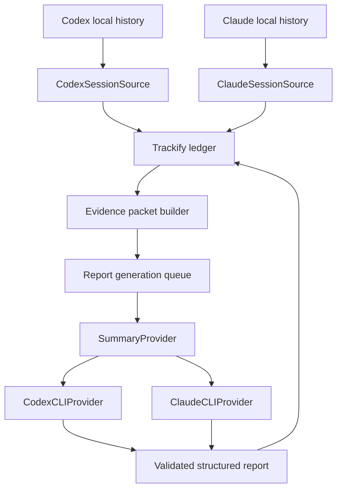

# Codex and Claude Provider Integration

Status: Proposed
Last verified against official CLI documentation: 2026-08-05

## 1. Purpose

Trackify must work fully for users of either Codex CLI or Claude Code CLI. A user may collect history from one or both tools and may use either authenticated CLI to generate hourly and daily reports.

Collection and summarization are independent. A user can collect both Codex and Claude sessions while generating reports through only one provider.

This document defines provider boundaries, model defaults, safe non-interactive invocation, authentication, structured output, failure behavior, testing, and feedback-loop prevention. Installation is defined in [INSTALLATION.md](./INSTALLATION.md).

## 2. Official capability basis

The integration relies only on documented provider behavior:

- Codex provides non-interactive `codex exec`, structured JSON output, JSON Schema output, ephemeral sessions, explicit model selection, reasoning-effort configuration, and reusable saved authentication. See [Codex non-interactive mode](https://learn.chatgpt.com/docs/non-interactive-mode), [Codex model selection](https://learn.chatgpt.com/docs/models), and [Codex authentication](https://learn.chatgpt.com/docs/auth).
- Claude Code provides non-interactive `claude -p`, JSON and JSON Schema output, model and effort flags, safe mode, tool restriction, non-persistent sessions, and reusable saved authentication. See the [Claude Code CLI reference](https://code.claude.com/docs/en/cli-usage), [programmatic usage](https://code.claude.com/docs/en/headless), and [model configuration](https://code.claude.com/docs/en/model-config).

Provider flags and model availability can change. Trackify records detected CLI versions, validates required capabilities during provider health checks, and keeps each invocation implementation versioned.

## 3. Architecture



The important separation is:

```text
ConversationSource ≠ SummaryProvider
```

- `ConversationSource` reads and normalizes historical sessions.
- `SummaryProvider` receives a bounded Trackify evidence packet and returns a report.
- Neither provider owns report scheduling, retries, storage, or report state.
- Provider selection never changes imported evidence.

## 4. Provider interfaces

Conceptual Swift boundaries:

```swift
protocol SummaryProvider {
    var id: SummaryProviderID { get }
    func health() async -> ProviderHealth
    func summarize(_ request: SummaryRequest) async throws -> SummaryResult
}

struct SummaryRequest {
    let period: DateInterval
    let state: ReportState
    let evidence: EvidencePacket
    let schemaVersion: Int
}

struct SummaryResult {
    let summary: String
    let topics: [String]
    let evidenceEventIDs: [EventID]
    let providerMetadata: ProviderRunMetadata
}
```

Provider implementations depend on a process runner abstraction so tests never require a live Codex or Claude installation.

## 5. V1 provider defaults

Trackify V1 defaults:

```text
Codex
  model:  gpt-5.6-sol
  effort: medium

Claude
  model:  opus
  effort: medium
```

These are quality-oriented rather than minimum-cost models. Medium effort limits unnecessary reasoning compared with higher settings, but it does not turn Sol or Opus into budget-tier models.

Trackify may later expose an optional economy profile:

```text
Codex:  gpt-5.6-terra · medium
Claude: sonnet · medium
```

The economy profile is not required for V1.

### Claude alias behavior

The `opus` alias intentionally follows the provider's recommended current Opus version and may change after a Claude Code update. Trackify records the effective model reported by the invocation when available.

Users who require reproducibility may configure a full model identifier. V1 defaults to the alias because it is more likely to work across Anthropic API, subscriptions, and supported enterprise providers.

### Codex model behavior

V1 explicitly requests `gpt-5.6-sol` with medium reasoning rather than inheriting a user's global Codex model configuration. Provider configuration remains local to Trackify and does not modify the user's Codex defaults.

## 6. Provider selection

Trackify uses the following precedence:

1. Explicit Trackify provider configuration.
2. Provider selected by the agent-driven bootstrap command.
3. The only installed and authenticated supported provider.
4. A one-time choice when both providers are installed and authenticated.
5. No provider, leaving report jobs pending while statistics continue working.

Trackify never silently moves report generation between billing providers after setup. Optional fallback requires explicit configuration.

Example configuration:

```json
{
  "summaryProvider": {
    "id": "claude-cli",
    "model": "opus",
    "effort": "medium",
    "fallbackProviderId": null
  }
}
```

Provider detection does not assume that an executable on `PATH` is authenticated. It checks both executable health and login state.

## 7. Authentication

Trackify does not collect, store, copy, or synchronize provider credentials.

### Codex

Health detection uses:

```bash
codex --version
codex login status
```

When authentication is missing, Trackify offers to open:

```bash
codex login
```

Codex authentication may use ChatGPT sign-in or an API key. Trackify reuses the CLI's existing authentication context and does not read `auth.json` directly.

### Claude

Health detection uses:

```bash
claude --version
claude auth status
```

When authentication is missing, Trackify offers to open:

```bash
claude auth login
```

Trackify reuses the authentication method already supported by the installed Claude Code CLI, including subscription, Console, or organization-managed provider access. It does not read credentials from the keychain or Claude configuration files.

### Authentication state

Provider health states:

```text
not_installed
installed_not_authenticated
ready
unsupported_version
model_unavailable
rate_limited
temporarily_unavailable
policy_blocked
misconfigured
```

Statistics and collection remain operational for every provider state.

## 8. Codex CLI invocation

Representative V1 invocation:

```bash
codex exec \
  --ephemeral \
  --ignore-user-config \
  --ignore-rules \
  --sandbox read-only \
  --skip-git-repo-check \
  --model gpt-5.6-sol \
  -c 'model_reasoning_effort="medium"' \
  --output-schema /path/to/report.schema.json \
  -
```

Trackify sends the complete instruction and bounded evidence packet through standard input. The process runs from a dedicated Trackify working directory rather than a monitored repository.

Flags serve these purposes:

- `--ephemeral` prevents the summarization session from being persisted.
- `--ignore-user-config` avoids unrelated user MCP servers, hooks, and provider configuration while preserving authentication.
- `--ignore-rules` prevents project or user execution rules from affecting a no-tool report request.
- `--sandbox read-only` prevents writes.
- `--skip-git-repo-check` permits execution from Trackify's non-repository working directory.
- `--model` and the inline configuration fix the Trackify model profile without changing user defaults.
- `--output-schema` validates the final structured response.

The exact command is assembled as an argument array and executed without a shell.

## 9. Claude CLI invocation

Representative V1 invocation:

```bash
claude --safe-mode -p \
  --no-session-persistence \
  --model opus \
  --effort medium \
  --tools "" \
  --strict-mcp-config \
  --output-format json \
  --json-schema '<report-schema>' \
  '<report-prompt>'
```

Flags serve these purposes:

- `--safe-mode` disables personal and project customizations while retaining normal authentication.
- `-p` runs non-interactively and exits.
- `--no-session-persistence` prevents the summarization session from entering Claude history.
- `--model` and `--effort` select the Trackify profile without modifying user settings.
- `--tools ""` removes built-in tools from the request.
- `--strict-mcp-config` prevents configured MCP tools from loading.
- `--output-format json` and `--json-schema` provide validated structured output.

Trackify deliberately does not use Claude `--bare` for subscription-authenticated users because documented bare mode does not use OAuth credentials or the system keychain. Safe mode provides isolation while retaining authentication.

The exact command is assembled as an argument array and executed without a shell.

## 10. Feedback-loop prevention

Trackify-generated reports must never become new work evidence.

Without prevention, the following loop is possible:

```text
Trackify invokes provider
→ provider writes a local session
→ Trackify imports the session
→ report evidence includes that session
→ Trackify invokes provider again
```

V1 prevents this at several levels:

1. Codex report runs use `--ephemeral`.
2. Claude report runs use `--no-session-persistence`.
3. Provider processes run outside monitored repositories.
4. Provider processes receive a `TRACKIFY_INTERNAL_RUN=1` environment marker.
5. Trackify records each provider run identifier and time range.
6. Session collectors exclude records positively identified as internal Trackify report runs.
7. Imported source activity never treats the Trackify Application Support directory as a coding repository.

Ephemeral execution is the primary control; collector exclusion is defense in depth.

## 11. Evidence minimization

Summary providers receive an evidence packet, not unrestricted repository access.

The packet may contain:

- Period and report state.
- Repository names and relative identifiers.
- Commits and messages.
- File paths and diff statistics.
- Beginning and ending working-tree state.
- Relevant session excerpts.
- Agent-run, test, and build outcomes.
- Previous-period summary when work continues.
- Stable evidence identifiers.

Full source-code diffs and unrelated conversation history are excluded by default. The provider has no tools with which to inspect the filesystem.

## 12. Structured report contract

Both providers return the same schema:

```json
{
  "summary": "Continued implementing repository discovery. Tests remained active and the changes were uncommitted at the end of the hour.",
  "topics": ["repository discovery", "Git metadata"],
  "evidenceEventIds": ["event-1", "event-2"]
}
```

The report state is derived before model invocation and is not freely selected by the provider.

Validation requires:

- Valid schema.
- Non-empty concise summary.
- No evidence identifiers outside the supplied packet.
- No unsupported completion claim for a non-completed state.
- Bounded summary and topic lengths.

Invalid provider output is retained as diagnostic metadata but not published as the active report.

## 13. Scheduling, batching, and cost control

- `no_activity` reports are generated deterministically without a provider call.
- Current-hour previews are deterministic and do not repeatedly invoke a provider.
- Closed hourly reports are queued after a short late-evidence delay.
- Daily reports summarize hourly reports and day-level changes rather than raw full-day history.
- Historical backfill can defer report generation.
- Adjacent missing hourly reports may be batched when the provider schema supports a result per period.
- Provider concurrency is bounded independently from collection.
- Retry uses exponential backoff with a maximum attempt count and visible pending state.
- Rate limits or exhausted subscription usage never block ledger collection.

Backfill planning happens before provider calls. Trackify reports the number of active periods, deterministic no-activity periods, planned provider jobs, and approximate input tokens. It does not present an unreliable cross-provider dollar estimate.

Evidence reduction happens locally:

- Repeated file observations are aggregated.
- Unchanged observations are omitted.
- File paths, commit messages, and statistics are preferred over full diffs.
- Only report-relevant session excerpts are included.
- Each period has an evidence budget and explicit truncation metadata.
- Several adjacent periods may share one request while retaining independent structured results.
- Older reports remain on demand after broad evidence import.

Trackify records provider, requested model, effective model when available, effort, CLI version, invocation version, prompt version, token or usage metadata when available, duration, and result status.

## 14. Provider failure behavior

Failures are classified before retry:

```text
retryable
  temporary network failure
  provider overload
  rate limit with retry guidance
  transient invalid output

requires user action
  missing authentication
  unavailable model
  organization policy restriction
  unsupported CLI version

permanent for request
  evidence rejected by provider
  repeated schema violation
  request exceeds configured limit
```

The latest valid report remains visible when a revision fails. Pending or failed reports are visible in Diagnostics without replacing healthy statistics.

## 15. Configuration and CLI

Required Trackify commands:

```bash
trackify providers list
trackify providers detect
trackify providers status [codex|claude]
trackify providers use codex
trackify providers use claude
trackify providers test [codex|claude]
```

Examples:

```bash
trackify providers use codex \
  --model gpt-5.6-sol \
  --effort medium

trackify providers use claude \
  --model opus \
  --effort medium
```

Provider testing sends a small synthetic evidence packet, validates output, marks the resulting run as internal, and does not write a normal report.

## 16. Testing

### Contract tests

The same test suite runs against mocked Codex and Claude process runners:

- Valid structured response.
- Invalid JSON.
- Schema violation.
- Unsupported evidence identifiers.
- Timeout.
- Non-zero exit status.
- Authentication failure.
- Model unavailable.
- Rate limit.
- Cancellation during application shutdown.

### Invocation tests

- Arguments are passed without shell interpolation.
- Evidence is bounded and sent through the intended channel.
- Codex runs are ephemeral and read-only.
- Claude runs are non-persistent, safe-mode, and tool-free.
- User model configuration is not modified.
- Provider authentication files are never read by Trackify.

### Feedback-loop tests

- Internal report runs never appear in imported work sessions.
- A simulated persisted internal session is excluded by the defense-in-depth filter.
- Repeated reporting does not increase work time or session counts.
- The Application Support report workspace is never discovered as a repository source.

### Compatibility tests

- Minimum supported Codex CLI version.
- Minimum supported Claude Code CLI version.
- Capability detection when a newer provider adds or removes output fields.
- Model alias changes recorded through effective provider metadata.
- Organization-managed provider restrictions reported clearly.

## 17. V1 acceptance criteria

1. Trackify operates fully with only an authenticated Codex CLI.
2. Trackify operates fully with only an authenticated Claude Code CLI.
3. Both conversation sources can be collected regardless of selected summary provider.
4. Provider selection never changes user-wide Codex or Claude configuration.
5. Codex reports use `gpt-5.6-sol` with medium reasoning by default.
6. Claude reports use `opus` with medium effort by default.
7. Both providers return the same validated Trackify report schema.
8. Provider processes cannot modify repositories or invoke tools during report generation.
9. Trackify report-generation runs do not enter the work ledger.
10. Missing authentication or provider downtime does not interrupt statistics or collection.
11. Failed reports remain retryable and visible in Diagnostics.
12. Every report records provider, model, effort, CLI version, and prompt version.
13. The user can explicitly select either provider through the app or CLI.
14. Trackify never silently switches to another provider or billing context.
15. Backfill planning estimates provider jobs and input tokens before report generation.
16. Broad evidence import can complete without generating historical model reports.
