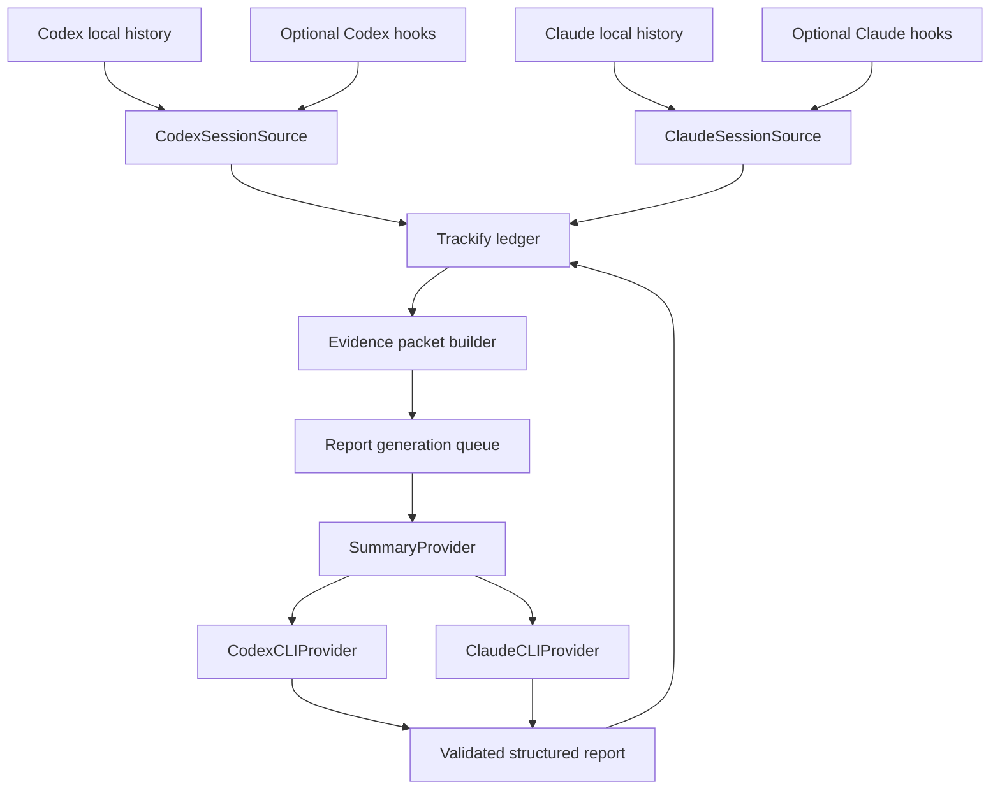

# Codex and Claude Provider Integration

Status: Goal 2 implementation complete; live release reconciliation pending
Last verified against official CLI documentation: 2026-08-05

## 1. Purpose

Trackify must work fully for users of either Codex CLI or Claude Code CLI. A user may collect history from one or both tools and may use either authenticated CLI to generate hourly and daily reports.

Collection and summarization are independent. A user can collect both Codex and Claude sessions while generating reports through only one provider.

This document defines report-provider boundaries, model defaults, safe non-interactive invocation, authentication, structured output, failure behavior, testing, and feedback-loop prevention. Live lifecycle hooks and persisted conversation-cache compatibility are source concerns defined in [SOURCE_COMPATIBILITY.md](./SOURCE_COMPATIBILITY.md). Installation is defined in [INSTALLATION.md](./INSTALLATION.md).

## 2. Official capability basis

The integration relies only on documented provider behavior:

- Codex provides non-interactive `codex exec`, structured JSON output, JSON Schema output, ephemeral sessions, explicit model selection, reasoning-effort configuration, and reusable saved authentication. See [Codex non-interactive mode](https://learn.chatgpt.com/docs/non-interactive-mode), [Codex model selection](https://learn.chatgpt.com/docs/models), and [Codex authentication](https://learn.chatgpt.com/docs/auth).
- Claude Code provides non-interactive `claude -p`, JSON and JSON Schema output, model and effort flags, safe mode, tool restriction, non-persistent sessions, and reusable saved authentication. See the [Claude Code CLI reference](https://code.claude.com/docs/en/cli-usage), [programmatic usage](https://code.claude.com/docs/en/headless), and [model configuration](https://code.claude.com/docs/en/model-config).

Provider flags and model availability can change. Trackify records detected CLI versions, validates required capabilities during provider health checks, and keeps each invocation implementation versioned.

## 3. Architecture



The important separation is:

```text
ConversationSource ≠ SummaryProvider
```

- `ConversationSource` reads and normalizes persisted history plus optional allowlisted live lifecycle observations.
- `SummaryProvider` receives a bounded Trackify evidence packet and returns a report.
- Neither provider owns report scheduling, retries, storage, or report state.
- Provider selection never changes imported evidence.

## 4. Provider interfaces

Conceptual Swift boundaries:

```swift
protocol SummaryProvider {
    var id: SummaryProviderID { get }
    func health() async -> ProviderHealth
    func summarize(_ request: SummaryRequest) async throws -> SummaryResult
}

struct SummaryRequest {
    let period: DateInterval
    let state: ReportState
    let evidence: EvidencePacket
    let schemaVersion: Int
}

struct SummaryResult {
    let summary: String
    let topics: [String]
    let evidenceAliases: [String]
    let providerMetadata: ProviderRunMetadata
}
```

Provider implementations depend on a process runner abstraction so tests never require a live Codex or Claude installation.

## 5. V1 provider defaults

Trackify V1 defaults:

```text
Codex
  model:  gpt-5.6-sol
  effort: medium

Claude
  model:  opus
  effort: medium
```

These are quality-oriented rather than minimum-cost models. Medium effort limits unnecessary reasoning compared with higher settings, but it does not turn Sol or Opus into budget-tier models.

Trackify may later expose an optional economy profile:

```text
Codex:  gpt-5.6-terra · medium
Claude: opus
```

The economy profile is not required for V1.

### Claude alias behavior

The `opus` alias intentionally follows the provider's recommended current Opus version and may change after a Claude Code update. Trackify records the effective model reported by the invocation when available.

Users who require reproducibility may configure a full model identifier. V1 defaults to the alias because it is more likely to work across Anthropic API, subscriptions, and supported enterprise providers.

### Codex model behavior

V1 explicitly requests `gpt-5.6-sol` with medium reasoning rather than inheriting a user's global Codex model configuration. Provider configuration remains local to Trackify and does not modify the user's Codex defaults.

## 6. Provider selection

Trackify exposes four stable selection modes:

1. `automatic`: choose the first ready provider in deterministic Codex-then-Claude order.
2. `codex`: invoke Codex only; failure falls back to a local artifact, never Claude.
3. `claude`: invoke Claude only; failure falls back to a local artifact, never Codex.
4. `local_only`: create deterministic artifacts and invoke no provider.

Fresh installs keep scheduled model reporting disabled even when Automatic can
identify a ready provider. Enabling scheduled reports is explicit. On-demand
generation, provider tests, and bounded model backfill are separately explicit.

The settings format retains the legacy provider field for migration while the
effective configuration is represented by `providerSelection`, budgets, and the
scheduled-model-report switch.

Example configuration:

```json
{
  "providerSelection": "claude",
  "scheduledModelReportsEnabled": true,
  "generationBudgets": {
    "maximumInputBytesPerCall": 20480,
    "maximumEstimatedInputTokensPerCall": 24000,
    "maximumCallsPerDay": 8,
    "dailyTokenLimit": 50000,
    "processDeadlineSeconds": 180
  }
}
```

Provider detection does not equate executable presence with proven authentication. It checks login state when the observed CLI exposes a bounded non-interactive status command and otherwise reports that authentication is unknown until a real report invocation verifies access.

## 7. Authentication

Trackify does not collect, store, copy, or synchronize provider credentials.

### Codex

Health detection uses:

```bash
codex --version
codex login status
```

When authentication is missing, Trackify offers to open:

```bash
codex login
```

Codex authentication may use ChatGPT sign-in or an API key. Trackify reuses the CLI's existing authentication context and does not read `auth.json` directly.

### Claude

Trackify checks the newest Claude Desktop-bundled Code CLI first, then
`~/.local/bin/claude`, then `PATH`. This matters because Desktop and terminal
installations may have different versions or authentication contexts. The
effective executable and version are visible in Preferences and CLI status.

Observed Claude Code releases do not expose a bounded non-interactive
authentication-status subcommand. Running an undocumented auth command may open
the interactive CLI, so Trackify deliberately does not invoke it during passive
health checks. Executable discovery therefore reports `authentication_unknown`;
the explicit synthetic test or first enabled report verifies access and records
authentication failure, timeout, or success without exposing provider output.
The latest durable success promotes Claude to ready for Automatic selection; an
explicit authentication failure demotes it until a later successful test or
invocation. Generic process failures and timeouts do not guess authentication.

When a future supported Claude Code version exposes a documented non-interactive status command, the adapter may add a version-gated probe. Trackify never reads Claude credential or Keychain data directly.

The observed Claude invocation remains:

```bash
claude --version
```

### Authentication state

Provider health states:

```text
not_installed
authentication_unknown
ready
unavailable
```

`unavailable` includes a failed Codex login-status probe. More specific rate-limit, policy, model, and version states may be added after supported CLIs expose stable machine-readable diagnostics. Statistics and collection remain operational for every provider state.

## 8. Codex CLI invocation

Representative V1 invocation:

```bash
codex exec \
  --ephemeral \
  --ignore-user-config \
  --ignore-rules \
  --sandbox read-only \
  --skip-git-repo-check \
  --model gpt-5.6-sol \
  -c 'model_reasoning_effort="medium"' \
  --output-schema /path/to/report.schema.json \
  -
```

Trackify sends the complete instruction and bounded evidence packet through standard input. The process runs from a dedicated Trackify working directory rather than a monitored repository.

Flags serve these purposes:

- `--ephemeral` prevents the summarization session from being persisted.
- `--ignore-user-config` avoids unrelated user MCP servers, hooks, and provider configuration while preserving authentication.
- `--ignore-rules` prevents project or user execution rules from affecting a no-tool report request.
- `--sandbox read-only` prevents writes.
- `--skip-git-repo-check` permits execution from Trackify's non-repository working directory.
- `--model` and the inline configuration fix the Trackify model profile without changing user defaults.
- `--output-schema` validates the final structured response.

The exact command is assembled as an argument array and executed without a shell.

## 9. Claude CLI invocation

Representative V1 invocation:

```bash
claude --print \
  --no-session-persistence \
  --model opus \
  --tools "" \
  --strict-mcp-config \
  --output-format json \
  --json-schema '<report-schema>' \
  '<report-prompt>'
```

Flags serve these purposes:

- `--print` runs non-interactively and exits.
- `--no-session-persistence` prevents the summarization session from entering Claude history.
- `--model` selects the Trackify profile without modifying user settings.
- `--tools ""` removes built-in tools from the request.
- `--strict-mcp-config` prevents configured MCP tools from loading.
- `--output-format json` and `--json-schema` provide validated structured output.

The locally verified Claude Code CLI does not expose the previously proposed `--safe-mode` or `--effort` flags. V1 isolation therefore comes from a dedicated temporary working directory, disabled tools, strict MCP configuration, structured output, and disabled session persistence while retaining the user's normal authentication.

The exact command is assembled as an argument array and executed without a shell.

## 10. Feedback-loop prevention

Trackify-generated reports must never become new work evidence.

Without prevention, the following loop is possible:

```text
Trackify invokes provider
→ provider writes a local session
→ Trackify imports the session
→ report evidence includes that session
→ Trackify invokes provider again
```

V1 prevents this at several levels:

1. Codex report runs use `--ephemeral`.
2. Claude report runs use `--no-session-persistence`.
3. Provider processes run outside monitored repositories.
4. Provider processes receive a `TRACKIFY_INTERNAL_RUN=1` environment marker.
5. Trackify records each provider run identifier and time range.
6. Session collectors exclude records positively identified as internal Trackify report runs.
7. Imported source activity never treats the Trackify Application Support directory as a coding repository.

Ephemeral execution is the primary control; collector exclusion is defense in depth.

## 11. Evidence minimization

Summary providers receive an evidence packet, not unrestricted repository access.

The packet contains only a bounded, deterministically selected view of locally
normalized evidence:

- Period, locally derived report state, and aggregate metrics.
- At most 30 event digests for an hour or 12 day-level event digests for a day.
- Up to 24 active hourly report digests for hierarchical daily coverage; quiet
  hours are represented by omission metadata rather than repeated prose.
- Short packet-local event, repository, session, and hourly-report aliases. Stable
  ledger identifiers remain local and are restored after structured validation.
- Repository names when Trackify can associate them without guessing.
- Commit metadata, working-tree counts and state, and agent/build/test lifecycle outcomes carried by those events.
- Locally redacted message excerpts joined from normalized Codex or Claude
  messages. Each excerpt carries its typed user or assistant role and is capped
  at 280 characters; allowlisted structured payload values are capped at 160
  characters and hourly report digests at 220 characters.
- Selection reasons, total/selected/omitted counts, per-kind omissions, context
  coverage, and quiet-hour counts.

The compiler partitions work by repository or session, reserves coverage for
parallel contexts, then prioritizes user intent, failures, commits, completed
tests/builds, final working-tree state, and bounded assistant progress. Repeated
message and state observations are deduplicated before selection, and per-context
message/type limits prevent agent chatter from consuming the remaining packet.

Full source-code diffs, unrestricted file contents, absolute repository paths,
complete transcripts, unrelated conversation history, and provider credentials
are not included. The provider has no tools with which to inspect the filesystem.
Compiled evidence is capped at 20 KiB; the provider prompt retains its independent
256 KiB defense-in-depth ceiling. Oversized input fails closed to deterministic
reporting.

## 12. Structured report contract

Both providers return the same schema:

```json
{
  "summary": "Continued implementing repository discovery. Tests remained active and the changes were uncommitted at the end of the hour.",
  "topics": ["repository discovery", "Git metadata"],
  "evidenceAliases": ["e1", "e2"]
}
```

The report state is derived before model invocation and is not freely selected by the provider.

The prompt explicitly defines user messages as evidence of requested goals, questions, and decisions. Assistant messages are progress claims or implementation context. Providers may pair intent and outcomes only when a shared session or repository association supports the relationship. They must use concrete commits, tests, changes, and the final derived state rather than accepting an assistant completion statement as proof or blending parallel projects.

Validation requires:

- Valid schema.
- Non-empty concise summary.
- No evidence aliases outside the supplied packet.
- At least one valid alias when the packet contains evidence.
- Unique aliases and bounded topic counts.
- Bounded summary and topic lengths.

The provider cannot override the locally derived report state; that state is stored and displayed independently from the narrative. The prompt requires the narrative to describe unfinished, waiting, failed, and inactive work honestly, while structural validation prevents fabricated evidence links. Semantic claim verification is deliberately not presented as deterministic in V1.

Invalid provider output is not published or retained as report content. Trackify records a bounded degraded-health issue and publishes the deterministic fallback instead.

## 13. Scheduling, batching, and cost control

- `no_activity` reports are generated deterministically without a provider call.
- Current-hour previews are deterministic and do not repeatedly invoke a provider.
- Only the most recent closed hourly and daily periods are considered after a wake or relaunch.
- Daily reports summarize hourly reports and day-level changes rather than raw full-day history.
- Historical evidence backfill never starts model work. Model backfill first returns a bounded plan and requires explicit confirmation.
- Provider concurrency is bounded independently from collection.
- Provider processes have a 180-second execution deadline and bounded captured output; timeout terminates and reaps the exact child before deterministic fallback.
- A failed provider invocation is classified in its durable run, falls back to a deterministic artifact, and leaves collection unaffected. Interrupted running jobs recover locally and are never replayed implicitly.
- Rate limits or exhausted subscription usage never block ledger collection.
- Per-call bytes/tokens, daily calls/tokens, optional monthly tokens, and optional daily/monthly money ceilings are evaluated before process start. Unknown billing remains unknown rather than defeating token/call budgets.

Backfill planning happens before provider calls. Trackify reports local history footprint plus conservative provider-call and input-token ceilings; inactive days reduce the actual calls to zero. It does not present an unreliable cross-provider dollar estimate.

Evidence reduction happens locally:

- Repeated/canonical-equivalent messages and state observations are deduplicated.
- User intent, concrete outcomes, failures, and final state are selected before
  general progress narration.
- Parallel repository/session contexts receive bounded round-robin coverage.
- File paths, commit messages, statistics, and short excerpts are preferred over
  full diffs or transcripts.
- Each period has a 20 KiB evidence budget and explicit selection/omission
  metadata.
- Daily reports use active hourly report digests plus selected day-level changes
  instead of the newest raw event suffix.
- Older reports remain on demand after broad evidence import.

`trackify report --preview` and `--preview-hour <iso8601>` expose safe packet
counts, kinds, context coverage, bytes, and estimated input tokens without saving
a report or invoking a provider.

Trackify records provider, requested model, effective model when available, CLI and invocation contract, compiler/prompt/output schema versions, separate input/cached/output/reasoning tokens when available, honest cost kind and billing context, queue/execution duration, result status, and artifact provenance.

## 14. Provider failure behavior

Failures are classified before fallback or any future explicit retry:

```text
retryable
  temporary network failure
  provider overload
  rate limit with retry guidance
  transient invalid output

requires user action
  missing authentication
  unavailable model
  organization policy restriction
  unsupported CLI version

permanent for request
  evidence rejected by provider
  repeated schema violation
  request exceeds configured limit
```

Every attempt remains visible in Usage as pending, running, succeeded, fallback,
failed, timed out, or cancelled. Provider output is stored only after schema and
evidence-alias validation; otherwise the deterministic artifact remains the
usable result.

## 15. Configuration and CLI

Required Trackify commands:

```bash
trackify providers list
trackify providers status
trackify providers use codex
trackify providers use claude
trackify providers use automatic
trackify providers use local
trackify providers test codex --json
trackify sources status --json
trackify usage runs --since 7d --json
trackify recipes list --json
trackify artifacts list --since 7d --json
```

Examples:

```bash
trackify providers use codex

trackify providers use claude
```

Provider invocation is contract-tested with mock process runners. A real provider is exercised only when the user requests a report or accepts report backfill, avoiding surprise token use.

## 16. Agent integration boundary

V1 treats Codex and Claude as both evidence sources and optional report providers, but it does not make either tool part of Trackify's core. The local ledger and deterministic statistics continue to work when neither CLI is installed, authenticated, or available.

### Required in V1

- Import supported Codex and Claude persisted histories through versioned, independently testable source adapters.
- Accept optional allowlisted lifecycle events through the provider-neutral `trackify integrations emit` bridge. Persisted history remains the recovery and backfill authority.
- Expose bounded, versioned JSON from `trackify context`, `today`, `day`, `timeline`, `search`, and `show` so either agent can inspect the same ledger without scraping app UI or reading the database directly.
- Preserve source, session, turn, repository, time-range, and evidence provenance wherever the provider exposes it. Missing relationships remain unknown rather than guessed.
- Generate reports through an explicitly selected authenticated CLI using the common `SummaryProvider` contract and the same validated output schema.
- Detect provider availability safely, surface degraded states honestly, and keep collection and deterministic reporting operational when a provider fails.
- Exclude Trackify's own report-generation runs from imported activity so summaries cannot create a feedback loop.
- Keep installation and bootstrap agent-friendly through stable machine-readable commands, bounded recommendations, and explicit confirmation before evidence or report backfill.

### Architecture seams preserved in V1

- Conversation collection, lifecycle ingestion, ledger queries, and report generation are separate interfaces. A provider-format change cannot alter repository statistics or the query API.
- CLI JSON is the canonical agent contract. A later MCP server, Codex skill, or Claude plugin must call the same domain queries rather than introduce a second ledger API.
- Lifecycle events use an allowlist and stable deduplication identity. Later provider-specific hook installers can configure this bridge without changing ingestion semantics.
- Reports and query results include stable identifiers and evidence links. Later deep links or provider UI affordances can open the corresponding Trackify period, repository, session, or report.
- Provider capability and invocation versions are recorded. Later compatibility shims can be selected by observed capability instead of scattered version checks.

### Deliberately deferred

- A read-only `trackify mcp serve` adapter for direct tool calls from Codex and Claude.
- Provider-specific Codex skills or Claude plugins that teach agents when and how to query the ledger.
- Automatic installation or mutation of provider hook/configuration files. Until those contracts are stable, setup may print or apply only an explicitly confirmed, documented bridge configuration.
- Automatic context injection into every coding conversation. Agents request bounded context when it is relevant, avoiding token cost and stale context.
- Bidirectional control such as starting tasks, changing Trackify configuration, or editing reports from an agent conversation.
- Semantic transcript search, embeddings, cross-machine/team history, session continuation, and provider usage or billing dashboards.

These features can be added later without a database or UI redesign. They should be promoted into the core only when a real workflow demonstrates that the CLI contract is insufficient.

### Why this is enough for V1

An agent can already install and bootstrap Trackify, emit allowlisted lifecycle evidence, and query the complete bounded ledger through stable CLI JSON. Trackify can independently consume both providers' persisted histories and use either authenticated CLI for optional narratives. MCP and provider-specific packages would improve discovery and ergonomics, but they would not add a missing core capability; keeping them thin and deferred avoids coupling the ledger to either vendor's extension format.

## 17. Testing

### Contract tests

The same test suite runs against mocked Codex and Claude process runners:

- Valid structured response.
- Invalid JSON.
- Schema violation.
- Unsupported evidence identifiers.
- Timeout.
- Non-zero exit status.
- Authentication failure.
- Model unavailable.
- Rate limit.
- Cancellation during application shutdown.

### Invocation tests

- Arguments are passed without shell interpolation.
- Evidence is bounded and sent through the intended channel.
- Codex runs are ephemeral and read-only.
- Claude runs are non-persistent, MCP-isolated, and tool-free.
- User model configuration is not modified.
- Provider authentication files are never read by Trackify.

### Feedback-loop tests

- Internal report runs never appear in imported work sessions.
- A simulated persisted internal session is excluded by the defense-in-depth filter.
- Repeated reporting does not increase active evidence hours, LLM turns, or session counts.
- The Application Support report workspace is never discovered as a repository source.

### Compatibility tests

- Minimum supported Codex CLI version.
- Minimum supported Claude Code CLI version.
- Capability detection when a newer provider adds or removes output fields.
- Model alias changes recorded through effective provider metadata.
- Organization-managed provider restrictions reported clearly.

## 18. V1 acceptance criteria

1. Trackify operates fully with only an authenticated Codex CLI.
2. Trackify operates fully with only an authenticated Claude Code CLI.
3. Both conversation sources can be collected regardless of selected summary provider.
4. Provider selection never changes user-wide Codex or Claude configuration.
5. Codex reports use `gpt-5.6-sol` with medium reasoning by default.
6. Claude reports use the `opus` alias with Claude Code's supported default effort behavior.
7. Both providers return the same validated Trackify report schema.
8. Provider processes cannot modify repositories or invoke tools during report generation.
9. Trackify report-generation runs do not enter the work ledger.
10. Missing authentication or provider downtime does not interrupt statistics or collection.
11. Failed reports remain retryable and visible in Diagnostics.
12. Every report records provider, model, effort, CLI version, and prompt version.
13. The user can explicitly select either provider through the app or CLI.
14. Trackify never silently switches to another provider or billing context.
15. Backfill planning estimates provider jobs and input tokens before report generation.
16. Broad evidence import can complete without generating historical model reports.
