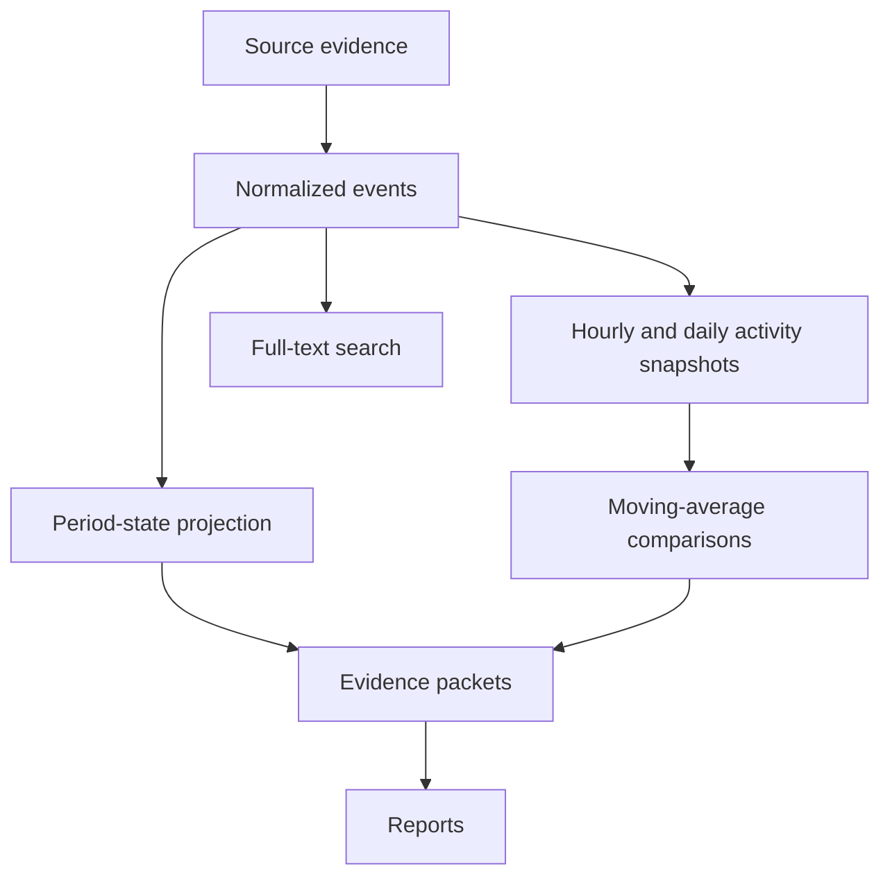

# Trackify V1 Specification

Status: V1 release-candidate implementation
Last updated: 2026-08-06

## 1. V1 outcome

Trackify V1 is a passive, native macOS development-work ledger.

After initial source configuration, it runs continuously in the menu bar, observes local Git repositories and supported Codex and Claude conversations, and produces a searchable history containing simple evidence-backed statistics and short hourly and daily reports.

The same ledger is accessible through a first-class CLI so coding agents can recover recent project context without manually searching repositories and conversation caches.

V1 should make this possible:

```bash
trackify context --repo current --since 14d
```

Representative output:

```text
Project: trackify
Period: 2026-07-23 through 2026-08-05

Recent work:
- Implemented repository discovery and Git metadata scanning.
- Added the initial SQLite ledger and collection pipeline.
- Added hourly evidence summaries and moving-average comparisons.

Current state:
- Working tree remains dirty, so the latest report is in progress
- 7 modified files
- No commit since e815ba2
- Latest durable Codex message was observed 18 minutes ago
```

The broader product direction is defined in [VISION.md](./VISION.md). The complete architectural rationale is defined in [DESIGN.md](./DESIGN.md). Readiness gates and privacy behavior are defined in [V1_READINESS.md](./V1_READINESS.md) and [PRIVACY_SECURITY.md](./PRIVACY_SECURITY.md). Detailed V1 behavior is specified in [UI.md](./UI.md), [REPOSITORY_DISCOVERY.md](./REPOSITORY_DISCOVERY.md), [SOURCE_COMPATIBILITY.md](./SOURCE_COMPATIBILITY.md), [LLM_PROVIDERS.md](./LLM_PROVIDERS.md), [INSTALLATION.md](./INSTALLATION.md), and [UPDATES.md](./UPDATES.md).

## 2. Product principles for V1

### Passive by default

The user configures sources and exclusions, then primarily observes, searches, and copies results. Trackify does not require manual timers, task creation, report editing, or routine activity classification.

### Evidence before interpretation

Imported evidence and normalized events are durable. Activity snapshots, state projections, comparisons, and reports are derived and rebuildable.

### Project activity is not computer activity

Agent runs, builds, tests, repository changes, and related project signals determine detected work. Keyboard and mouse idleness is not authoritative.

### Honest state

Reports distinguish work that was completed, left in progress, investigated, waiting, or not detected. Commits and activity do not automatically imply completion.

### Simple statistics

V1 exposes understandable facts and compares each metric with a moving average. It does not produce a composite productivity score.

### GUI and CLI parity

The macOS application and CLI use the same domain queries and ledger. The UI must not contain business logic unavailable to the CLI.

## 3. V1 user experience

### 3.1 Initial setup

Initial setup should require only:

1. Confirming or adding repository roots and their automatic group labels.
2. Enabling discovered Codex and Claude sources.
3. Detecting Codex and Claude CLIs, checking authentication where the installed version supports a safe non-interactive probe, and selecting the report provider.
4. Reviewing excluded paths.
5. Reviewing one combined recommendation for primary groups, evidence history, and recent report generation.

Setup reports missing permissions or unavailable sources clearly. The application remains useful with Git-only collection if conversation sources or summarization are unavailable.

### 3.2 Menu bar

The menu bar is the primary daily interface.

It shows:

- The latest durable evidence and when it was observed.
- Active evidence hours today.
- LLM turns and conversation-message counts.
- Commits, changed lines, files, and repositories.
- Comparison with a trailing moving average.
- A compact hourly activity visualization.
- The latest report and its state.
- Collector or summarizer health when degraded.

Primary actions:

- Open the main window.
- Pause or resume collection.
- Open the secondary menu for Sync now, Settings, update check, and Quit.

### 3.3 Main window

V1 includes three primary destinations. Date browsing, reports, and search are integrated where they are used instead of duplicating the same ledger across separate screens.

#### Overview

- Today, 7-day, and 30-day evidence-backed statistics.
- A trend chart and clickable six-week history heatmap with visible inactive days.
- Explicit current/selected date, direct date picker, and previous/next navigation.
- Stored reports and repository focus for the selected range.

#### Activity

- Reverse-chronological reports and concrete evidence grouped by day.
- Inline search across reports, commits, repositories, paths, and session messages.
- All, Reports, Commits, Conversations, and Changes filters.
- Honest completed, in-progress, investigating, observed, and no-activity states when evidence supports them.

#### Projects

- Discovered repositories and working copies.
- Latest known repository state.
- Deterministic grouping by discovery root and relative path.

### 3.4 Settings and diagnostics

The passive V1 app keeps Settings observational and small: launch-at-login, collection pause, provider health, automatic-update preference, installation origin, update check, and configured discovery roots. Agent-owned setup and the CLI manage roots, provider selection, private export, report deletion, diagnostics export, and backfill without duplicating those mutations in SwiftUI.

The app shows a compact degraded state without hiding healthy data. `trackify doctor` is the detailed diagnostic authority for collector issues, migrations, database size/integrity, backups, heartbeat, provider state, and allowlisted diagnostic export.

## 4. V1 CLI

### 4.1 Required commands

```bash
trackify status
trackify today
trackify day <date>
trackify timeline --since <duration>
trackify search <query>
trackify context --repo <repo> --since <duration>
trackify context --today --all --max-characters <count>
trackify repos
trackify roots list
trackify roots add <path> --name <name>
trackify roots scan [<root>]
trackify sessions
trackify report --today
trackify providers list
trackify providers status
trackify providers use <codex|claude>
trackify integrations status
trackify integrations emit <codex|claude> --session <id> --turn <id> --phase <phase>
trackify collect
trackify backfill --from <date> --to <date>
trackify doctor
trackify doctor --export <diagnostic-json>
trackify data path
trackify data export <destination.sqlite>
trackify data delete-reports --confirm
trackify update status --json
trackify update check --json
trackify update install --relaunch --json
trackify bootstrap inspect --json
trackify bootstrap apply --provider auto --backfill-evidence all --backfill-reports 14d --launch
```

Evidence inspection:

```bash
trackify show report <id> [--evidence-limit <count>]
trackify show session <id> [--message-limit <count>]
trackify show commit <id>
```

Development and testing:

```bash
trackify simulate --scenario foundation --speed instant --days 2
trackify simulate --scenario foundation --speed instant --days 2 --output-data-root <new-directory>
```

### 4.2 CLI contract

- Query commands provide concise human-readable output by default.
- Every query command supports versioned JSON through `--json`.
- Standard output contains requested data; diagnostics use standard error.
- Redirected output contains no ANSI formatting.
- Records expose stable identifiers for follow-up inspection.
- Repository-scoped commands can infer the current repository.
- Exit codes distinguish usage, unavailable data, collection failure, and internal failure.
- `context --today --all` builds one local-calendar-day ledger across every active repository without requiring an agent-side join.
- `context` respects a configurable character budget for both human and complete versioned JSON output. Context JSON contains the bounded rendered ledger rather than an unbounded duplicate object graph.
- Session inspection selects the latest requested message tail and returns it chronologically.
- Report JSON exposes total evidence counts and includes stable evidence identifiers only up to an explicit `--evidence-limit`; the default is zero.

## 5. V1 sources

### 5.1 Git

Trackify discovers repositories under configured roots and observes:

- Repository identity and working-copy paths.
- Discovery-root membership and relative folder hierarchy.
- Branch and HEAD.
- Commit identity, message, author time, and observed reachability.
- Working-tree clean or dirty state.
- Changed, added, deleted, renamed, untracked, and binary files.
- Committed and uncommitted line statistics where meaningful.

The system uses machine-readable output from the installed Git executable. Collection is read-only toward repositories.

### 5.2 Codex

The Codex adapter imports supported locally available:

- Sessions.
- Messages.
- Working-directory or repository associations.
- Tool or command activity relevant to work history.
- Run start, waiting, completion, failure, and interruption signals when available.

### 5.3 Claude

The Claude adapter implements the same normalized contract for supported local Claude conversation and run data.

### 5.4 Source behavior

- Each source adapter is independently versioned.
- Each source has an idempotent cursor-based import process.
- Codex and Claude may also provide optional live lifecycle events through their documented hook systems.
- Hook events improve live state, but persisted conversation caches remain the durable history, backfill, and recovery source.
- Hook and cache observations pass through the same normalized contract and are deduplicated by stable source identity or deterministic fingerprint.
- If hooks are unavailable, disabled, unsupported, or awaiting trust, Trackify continues through cache reconciliation without claiming real-time precision.
- One broken adapter does not stop other collectors.
- Partially written source data is retried safely.
- Source records retain original occurrence time and distinct observation time.
- Real redacted fixtures test each supported source format.

## 6. Core data model

V1 distinguishes durable evidence from rebuildable interpretation.



### 6.1 Durable evidence

- Repositories and working copies.
- Conversation sessions and messages.
- Commits and reachability observations.
- Working-tree snapshots.
- Agent, build, and test run observations.
- Allowlisted Codex and Claude live-hook observations and their ingestion provenance.
- Normalized events.
- Source identifiers, content hashes, timestamps, and parser versions.

### 6.2 Derived data

- Query-time period-state projections.
- Hourly and daily activity snapshots and moving-average comparisons.
- Evidence packets.
- Reports and report revisions.
- Full-text search indexes.

Derived records include the algorithm, prompt, model, or projection version that produced them.

### 6.3 Repository identity

V1 distinguishes repository identity from filesystem location:

```text
Repository
└── WorkingCopy
    └── Path
```

Paths may change without creating a new repository history. Multiple working copies or Git worktrees may belong to the same repository. User-facing project, client, and workspace grouping is deferred.

Each working-copy location belongs to a configured discovery root for the period during which that location is valid. Root labels provide automatic top-level groups such as Work and Personal; relative path segments provide deterministic visual subgroups. Path-based discovery and grouping are defined in [REPOSITORY_DISCOVERY.md](./REPOSITORY_DISCOVERY.md).

### 6.4 Session relationships

Sessions relate to repositories through a many-to-many relationship. Association records retain the automatic association method and supporting evidence. Sessions may remain unassigned when the available evidence is ambiguous.

V1 does not require the user to correct ambiguous associations.

### 6.5 Period state

Hourly and daily reports derive a cautious state directly from the evidence in that period. A failed build or test can support `investigating`; a final dirty working-tree transition can support `in_progress`; and a commit or completed build/test can support `completed`. Message-only periods are `observed`, and empty periods are `no_activity`.

V1 does not infer or persist a continuous work episode across gaps. A future optional live-telemetry view may expose explicit process lifecycles, but it remains separate from historical statistics and reports.

## 7. Time, backfill, and simulation

### 7.1 Clock and scheduler

Collection and simulation code receive injected wall clocks, while activity/report queries receive explicit cutoffs. The app alone owns the small real-time cadence loop.

- Production uses the system clock.
- Tests and simulations use a manually advanced virtual clock and call deterministic scheduling policy directly.
- Persisted records use wall-clock instants.
- Process durations may use a monotonic clock internally.
- Calendar queries use the selected timezone and explicit local boundaries. V1 batches hourly/day snapshot queries; persistence of rollup caches is deferred until profiling shows it is useful.

### 7.2 Active evidence hours

An active evidence hour is a local clock hour containing at least one durable core record: a reachable commit, a normalized Codex or Claude message, a real post-baseline working-tree transition, or a build/test record. It is a coverage count, not elapsed work duration. Multiple records in one clock hour still count as one active hour.

Lifecycle hooks, machine-idle state, file modification timestamps, and inferred gaps do not create active evidence hours. They may support an optional live-telemetry view later without changing historical statistics.

### 7.3 Observed windows and LLM turns

The observed window is the first through last core evidence timestamp in a selected period. It describes chronology, not continuous work. An LLM turn is counted from a durable normalized user message; assistant and tool messages remain separately countable conversation evidence.

### 7.4 Historical backfill

Backfill imports real historical evidence using the same collectors and normalization pipeline as live collection.

- Available evidence and deterministic statistics may be imported for the full retained history without model calls.
- The default first-run recommendation generates detailed reports only for the most recent 14 days.
- Original occurrence timestamps are preserved.
- Current import time is recorded separately.
- Repeated backfills remain idempotent.
- Affected derived ranges are rebuilt with boundary lookback and lookahead.
- Missing historical evidence is not invented.
- Report generation can be deferred during large backfills.
- Backfill planning reports history footprint and conservative provider-call and input-token ceilings before report generation.

### 7.5 Simulation

Simulation runs synthetic or recorded scenarios using the production engine and a virtual clock.

- Several days can execute in seconds.
- Hourly and daily boundaries trigger normally.
- Scenarios can contain parallel agents, waiting, failures, commits, unfinished work, and inactivity.
- Simulations always use a temporary or explicitly isolated database.
- Synthetic evidence is never written to the production ledger.
- The default test summarizer is deterministic and fixture-backed.

## 8. V1 metric definitions

V1 reports:

- Active evidence hours.
- First and last evidence timestamps.
- LLM turns and conversation messages.
- Commits observed.
- Committed additions and deletions.
- Current uncommitted additions and deletions.
- Observed editing churn when it can be calculated without double-counting snapshots.
- Net lines changed.
- Files touched.
- Repositories touched.
- Sessions represented in durable conversation evidence.
- Hourly evidence distribution.

Required rules:

- Working-tree snapshots are never summed directly.
- Incremental changes are derived from successive observations.
- Binary files do not contribute meaningless line counts.
- Ignored and configured generated paths are excluded from working-tree metrics.
- Observed commits remain audit records after a rebase or force-push, while headline commit and activity metrics count the currently reachable history.
- Commit reachability is recorded separately from commit existence so past imports remain inspectable.
- Metric output includes its derivation version.
- A record may be associated with multiple sources, but one local clock hour is counted only once in the day total.

Each metric is compared independently with a trailing moving average. V1 defaults to 14 active days and uses comparable local time-of-day totals for a live-day pace comparison.

## 9. Reporting

### 9.1 Period states

V1 supports:

```text
in_progress
completed
investigating
waiting
observed
no_activity
```

The state is derived from evidence before prose generation. `no_activity` is deterministic and does not call a model.

### 9.2 Evidence packets

Hourly evidence packets may include:

- Period state and aggregate activity metrics.
- At most 200 relevant core-event digests.
- Repository names and session identifiers when associated.
- Commit metadata, working-tree file/line counts and state, and agent/build/test outcomes represented by those events.
- Locally redacted normalized message excerpts capped at 600 characters.

Reports retain evidence identifiers for inspection.

### 9.3 Summarization

Reporting uses a narrow replaceable summarizer interface. V1 implements both Codex CLI and Claude Code CLI providers. Conversation collection remains independent from report-provider selection.

- Summaries are concise and evidence-constrained.
- Unfinished evidence uses cautious language.
- Model, provider, and prompt version are recorded.
- Closed hourly periods receive final reports after a short delay for late evidence.
- Restart reconciliation scans a bounded seven-day window once, fills missing active hourly/daily periods, and uses deterministic summaries for older catch-up periods so recovery does not create a token spike.
- Late evidence may create a new report revision.
- Daily reports summarize hourly reports and day-level evidence.
- Unavailable summarization does not block collection or statistics.
- A provider failure produces a deterministic evidence-backed report for the period and a visible degraded diagnostic; the next period tries the selected provider again without blocking collection.
- Codex report runs use `gpt-5.6-sol` with medium reasoning by default.
- Claude report runs use the `opus` alias with Claude Code's supported default effort behavior.
- Report invocations are read-only, tool-free, and non-persistent so they cannot enter the work ledger.

The complete provider contract is defined in [LLM_PROVIDERS.md](./LLM_PROVIDERS.md).

## 10. Search and agent context

V1 uses SQLite full-text search for:

- Report summaries and topics.
- Commit messages and hashes.
- Session messages.
- Repository names and remote identities.

Working-copy and relative paths remain available through repository catalog/context queries. Indexing individual changed-file paths is deliberately deferred because V1 records bounded file counts rather than retaining an ever-growing duplicate path history for every working-tree observation.

`trackify context` combines recent reports, current working-tree state, commits, sessions, and the latest evidence window. It prefers recent summaries and current state over raw messages when satisfying its output budget.

Embeddings and semantic search are deferred.

## 11. Reliability requirements

- Imports are transactional and idempotent.
- Collector cursors advance only after successful writes.
- The ledger uses migrations from the first schema version.
- The application creates a safe backup before future destructive migrations.
- SQLite uses WAL mode for concurrent application and CLI access.
- A collection lease prevents duplicate concurrent collection.
- Continuous collection publishes a heartbeat.
- Derived data can be rebuilt by time range without modifying source evidence.
- Collector, rollup, search, and report failures remain independently recoverable.
- App restart, machine sleep, and missed filesystem events are repaired through reconciliation.
- Missed, duplicated, delayed, or disabled provider hooks are repaired through persisted-cache reconciliation.
- Unsupported source formats are reported rather than partially misparsed.

### 11.1 Privacy and resource behavior

- V1 sends no product analytics and uploads no crash report automatically.
- Provider evidence packets are bounded and deterministically redacted locally.
- The ledger, configuration, backups, logs, and hook inbox use user-only filesystem permissions.
- Release-build idle CPU should average below 1% over ten minutes on the reference Mac.
- Idle resident memory should remain below 150 MB; bounded backfill should remain below 350 MB.
- Repository inspection is bounded to four concurrent Git processes and provider generation to one process by default.
- A seven-day soak test with at least 60 repositories validates sleep/wake recovery, bounded queues, and database growth.

Exact security behavior and the initial acceptance budgets are defined in [PRIVACY_SECURITY.md](./PRIVACY_SECURITY.md) and [V1_READINESS.md](./V1_READINESS.md).

## 12. V1 architecture

### 12.1 Process model

- `Trackify.app` owns continuous collection and scheduled reporting.
- `trackify` provides CLI queries and safe one-shot operations.
- Both depend on the same Swift packages and SQLite ledger.
- No separate daemon is required in V1.

### 12.2 Project structure

```text
trackify/
├── Package.swift
├── Sources/
│   ├── TrackifyDomain/
│   ├── TrackifyStore/
│   ├── TrackifyEngine/
│   └── TrackifyCLI/
├── Apps/
│   └── TrackifyMac/
├── Tests/
│   ├── TrackifyStoreTests/
│   ├── TrackifyEngineTests/
│   └── TrackifyCLITests/
└── docs/
```

Initial adapters and reporting implementations remain folders inside `TrackifyEngine`. New package targets are introduced only when dependency or compilation boundaries justify them.

### 12.3 Technology

- Swift and SwiftUI.
- Swift Package Manager.
- SQLite with GRDB.
- System Git CLI for repository inspection.
- SQLite FTS for search.
- Replaceable clock, scheduler, source adapter, and summarizer boundaries.
- A provider-neutral live-event inbox behind the same source adapter boundary as cache reconciliation.

## 13. Architecture prepared for later

V1 must not implement these features, but its data flow should leave them possible:

### Corrections and annotations

Evidence remains immutable, relationships remain explicit, and derived views remain reproducible. This allows a future correction layer between normalization and querying without adding manual interaction now.

### Project and client grouping

Queries accept repository sets, allowing future `projects` and `project_repositories` tables without changing repository identity.

### Export integrations

Queries and reports return clean domain values and versioned JSON, allowing future Clockify, Markdown, CSV, and API exporters.

### Additional collectors

Git, Codex, and Claude use the same collector boundary that future editors, terminals, builds, tests, or agents can implement. V1 does not build a plugin framework.

### Agent protocol adapters

Domain queries return bounded values independently from CLI formatting. This leaves room for a later read-only `trackify mcp serve` adapter exposing context, today, timeline, and search to Codex and Claude without duplicating query logic. Provider-specific plugins may later package that MCP adapter, a small discovery skill, and the V1 hook configuration. The CLI remains the canonical V1 agent interface.

V1 nevertheless preserves the important integration seams now: versioned JSON, stable evidence identifiers and provenance, provider-neutral lifecycle ingestion, capability-versioned adapters, evidence-backed report links, and feedback-loop prevention. It deliberately defers MCP distribution, provider-specific skills/plugins, automatic context injection, bidirectional agent control, and automatic provider-configuration mutation. The complete boundary and promotion criteria are defined in [LLM_PROVIDERS.md](./LLM_PROVIDERS.md#16-agent-integration-boundary).

This is an intentional V1 boundary, not a missing dependency. Codex and Claude can use the versioned CLI immediately; a future MCP server, Codex skill, or Claude plugin should remain a thin discovery and transport layer over those same commands. It must not read the SQLite database directly or create a second integration contract.

### Report providers

Codex CLI and Claude Code CLI implement the same summary-provider contract. Future providers can be added without changing evidence packets, report scheduling, or report storage. V1 does not build a general provider marketplace.

### Storage retention

Source payload storage remains behind the store boundary. V1 reports database size and supports export and deletion, but complex archival and retention policies are deferred until real usage data exists.

## 14. Explicitly deferred

- Manual report editing.
- Manual session/repository linking.
- Notes and bookmarks.
- Client and billable-hour classification.
- Semantic or embedding search.
- Remote sync.
- Team functionality.
- Plugin framework.
- Provider-specific Codex and Claude plugin packages.
- MCP server distribution and automatic context injection.
- Editor-specific integrations.
- Clockify synchronization.
- Composite productivity scoring.
- Custom dashboards.
- Complex retention policies.
- Notifications.
- Cross-device history.
- General task or project management.

## 15. Implementation milestones

### Milestone 1: Deterministic foundation

- Scaffold Swift packages and tests.
- Define domain identifiers and time types.
- Implement injected wall clocks and deterministic period-scheduling policy.
- Add the initial GRDB schema and migrations.
- Implement collector cursors, leases, and heartbeat.
- Add isolated database selection for simulation, with an explicit opt-in path for preserving a ledger for UI/CLI inspection.
- Implement `doctor`, `status`, and a minimal virtual-time scenario runner.

Exit condition: a two-day fixture advances instantly through real ingestion, derivation, scheduled-report policy, and activity queries without touching the production database.

### Milestone 2: Git ledger and backfill

- Implement repository and working-copy identity.
- Add labeled discovery roots, recursive discovery, exclusions, and path-based grouping.
- Preserve working-copy location and root-membership history.
- Import commits, reachability, and working-tree observations.
- Implement defined Git metrics without snapshot double-counting.
- Add idempotent Git backfill and deterministic range queries.
- Add `repos`, `today`, `timeline`, and initial search commands.

Exit condition: Trackify can reconstruct and query available Git activity for the previous two days, and repeating the backfill changes no totals.

### Milestone 3: Native passive experience

- Add the menu bar application and launch-at-login behavior.
- Add continuous collection and reconciliation.
- Implement Today, Day, and basic Calendar views.
- Show live statistics, source health, and degraded states.
- Add setup, source selection, exclusions, refresh, pause, and copy actions.

Exit condition: the app can run for a full workday without manual maintenance and accurately recover after sleep or restart.

### Milestone 4: Conversation ledger

- Implement Codex source discovery, fixtures, parsing, and repository association.
- Implement Claude source discovery, fixtures, parsing, and repository association.
- Import sessions, messages, and available run lifecycle signals.
- Implement optional documented lifecycle-hook bridges for Codex and Claude.
- Add a bounded private event inbox and deduplicate hook observations against cache imports.
- Expose whether the normalized lifecycle inbox has received records while retaining cache-only operation independently of provider hook configuration.
- Add session queries and full-text search.
- Backfill available conversation history.

Exit condition: Git, Codex, and Claude evidence for the same period is searchable through one ledger, live hook events improve current state when enabled, cache-only collection remains correct, and repeated or dual-path imports remain idempotent.

### Milestone 5: Evidence time and continuity

- Count active evidence hours and observed windows from durable point evidence.
- Count normalized user messages as LLM turns.
- Keep lifecycle intervals and open-ended runs as optional telemetry.
- Implement batched hourly and daily activity snapshots.
- Add moving-average comparisons.

Exit condition: a simulated two-day scenario containing messages, commits, inactivity, unfinished working-tree evidence, and a completed outcome produces deterministic evidence-backed activity snapshots; lifecycle-only telemetry does not create core activity.

### Milestone 6: Reports and context

- Assemble inspectable evidence packets.
- Implement the summarizer boundary, Codex CLI provider, and Claude Code CLI provider.
- Add provider detection, authentication health, model profiles, and explicit selection.
- Prevent internal report-generation sessions from entering the ledger.
- Add report states, revisions, deterministic provider fallback, and degraded diagnostics.
- Add hourly and daily reports.
- Implement `report`, `context`, and evidence inspection commands.

Exit condition: Trackify generates honest reports for completed, unfinished, investigative, waiting, and inactive periods, and continues collecting when summarization is unavailable.

### Milestone 7: V1 historical experience

- Complete Calendar, repository history, and Search views.
- Add export and deletion tools.
- Complete diagnostics and database-size visibility.
- Test migrations, backfill, deterministic re-querying, and long-running recovery.
- Package the signed application and CLI.
- Publish the signed release manifest and agent-readable installation protocol.
- Publish ad-hoc-signed GitHub Release artifacts, EdDSA-signed update metadata, and the stable Sparkle appcast.
- Implement idempotent bootstrap, repair, launch-at-login, and Sparkle update flows.
- Validate bounded setup inspection, guided group recommendations, one-step confirmation, and separate evidence/report backfill planning.

Exit condition: all V1 acceptance criteria are satisfied on a clean installation and an upgraded test ledger.

## 16. V1 acceptance criteria

V1 is complete when:

1. The application launches at login and collects without routine user interaction.
2. Configured Git repositories are discovered and reconciled after restart or sleep.
3. Newly cloned repositories beneath configured roots are discovered and grouped automatically.
4. Supported Codex and Claude histories are imported idempotently.
5. Historical evidence can be backfilled by date range.
6. Derived views can be re-queried and reports regenerated without changing imported evidence.
7. A multi-day simulation runs in seconds against an isolated database.
8. Core activity is reconstructed from durable Git and conversation evidence without consulting machine idleness.
9. Optional lifecycle telemetry does not create or alter core historical activity metrics.
10. Working-tree snapshots and rewritten Git history do not silently double-count metrics.
11. Hourly reports distinguish observed, completed, in-progress, investigating, and inactive periods without inferring completion from message timing alone.
12. Every generated report identifies its evidence and generator version.
13. Statistics and history remain available while summarization is unavailable.
14. Overview, Activity, and Projects operate from shared domain queries, with integrated date browsing, reports, and search.
15. The CLI exposes status, history, search, context, backfill, simulation, and diagnostics with JSON output.
16. An agent can recover a useful recent project ledger with one `trackify context` command.
17. Collector failures and missing permissions are visible through the app and `trackify doctor`.
18. The ledger survives application updates through tested migrations.
19. No manual timers, task creation, or report maintenance are required for normal operation.
20. Trackify can generate reports using only an authenticated Codex CLI or only an authenticated Claude Code CLI.
21. Provider report runs cannot modify repositories or re-enter the work ledger as imported sessions.
22. Codex or Claude can install, bootstrap, diagnose, and open Trackify from one stable link except for explicit provider-login and macOS privacy approvals.
23. The installer agent recommends primary groups using bounded aggregate discovery evidence and reliable conversation knowledge.
24. First-run backfill can import all available evidence while limiting initial model reports to the recent configured window.
25. A direct installation can discover and apply a signed update with one `Update & Relaunch` action.
26. The update preserves the ledger, configuration, collector cursors, login item, and bundled CLI version.
27. Homebrew, managed, and development installations defer to their owning update mechanism.
28. V1 performs no Trackify analytics or automatic crash-report upload.
29. Known synthetic secrets are removed locally before report-provider invocation or diagnostic export.
30. A release build satisfies the initial resource budgets and seven-day 60-repository soak test.
31. A configured Codex or Claude hook adapter can submit bounded normalized lifecycle state through `trackify integrations emit` without opening the ledger or waiting for the app.
32. Disabling hooks or losing hook events does not lose durable history; cache reconciliation repairs the ledger without duplicate sessions, messages, or metrics.

## 17. V1 release boundary

V1 is not defined by implementing every possible activity source. It is defined by proving that the ledger architecture works end to end:

```text
collect real evidence
→ preserve it safely
→ derive time and continuity
→ generate honest statistics and reports
→ retrieve the history through GUI and CLI
→ backfill, simulate, and query it reliably
```

Features outside that loop should not delay V1 unless they are required to keep the loop correct, passive, or recoverable.
