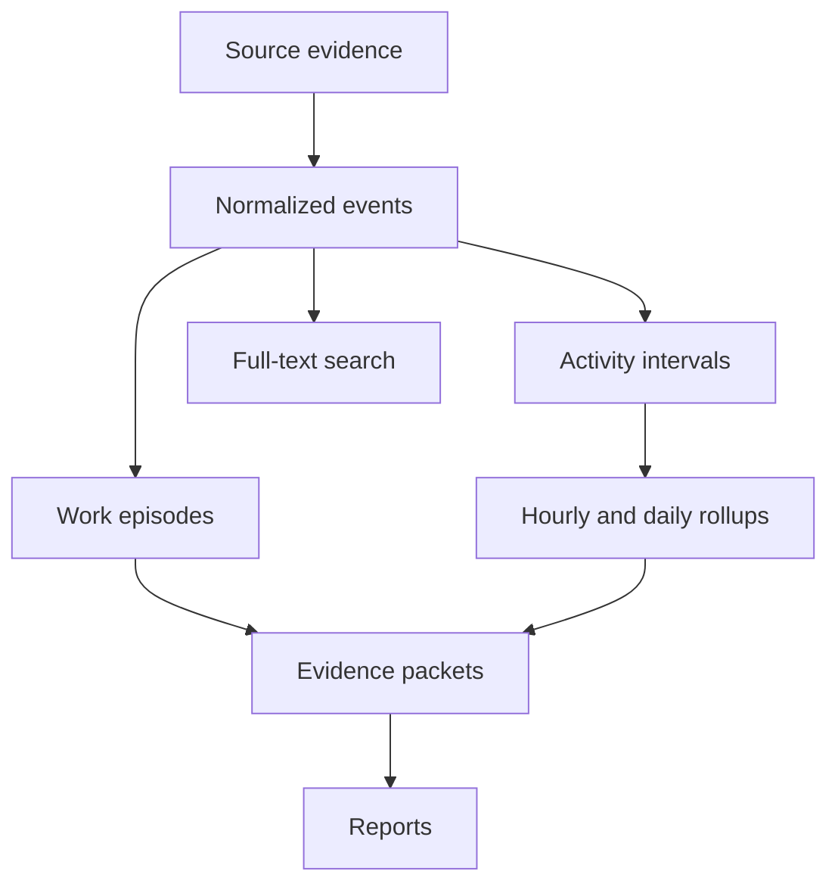

# Trackify V1 Specification

Status: Proposed
Last updated: 2026-08-05

## 1. V1 outcome

Trackify V1 is a passive, native macOS development-work ledger.

After initial source configuration, it runs continuously in the menu bar, observes local Git repositories and supported Codex and Claude conversations, and produces a searchable history containing simple statistics, work intervals, and short hourly and daily reports.

The same ledger is accessible through a first-class CLI so coding agents can recover recent project context without manually searching repositories and conversation caches.

V1 should make this possible:

```bash
trackify context --repo current --since 14d
```

Representative output:

```text
Project: trackify
Period: 2026-07-23 through 2026-08-05

Recent work:
- Implemented repository discovery and Git metadata scanning.
- Added the initial SQLite ledger and collection pipeline.
- Began work on hourly interval derivation.

Current state:
- Latest work episode remains in progress
- 7 modified files
- No commit since e815ba2
- One Codex run is active
```

The broader product direction is defined in [VISION.md](./VISION.md). The complete architectural rationale is defined in [DESIGN.md](./DESIGN.md). Readiness gates and privacy behavior are defined in [V1_READINESS.md](./V1_READINESS.md) and [PRIVACY_SECURITY.md](./PRIVACY_SECURITY.md). Detailed V1 behavior is specified in [UI.md](./UI.md), [REPOSITORY_DISCOVERY.md](./REPOSITORY_DISCOVERY.md), [SOURCE_COMPATIBILITY.md](./SOURCE_COMPATIBILITY.md), [LLM_PROVIDERS.md](./LLM_PROVIDERS.md), [INSTALLATION.md](./INSTALLATION.md), and [UPDATES.md](./UPDATES.md).

## 2. Product principles for V1

### Passive by default

The user configures sources and exclusions, then primarily observes, searches, and copies results. Trackify does not require manual timers, task creation, report editing, or routine activity classification.

### Evidence before interpretation

Imported evidence is durable. Events, intervals, rollups, work episodes, comparisons, and reports are derived and rebuildable.

### Project activity is not computer activity

Agent runs, builds, tests, repository changes, and related project signals determine detected work. Keyboard and mouse idleness is not authoritative.

### Honest state

Reports distinguish work that was completed, left in progress, investigated, waiting, or not detected. Commits and activity do not automatically imply completion.

### Simple statistics

V1 exposes understandable facts and compares each metric with a moving average. It does not produce a composite productivity score.

### GUI and CLI parity

The macOS application and CLI use the same domain queries and ledger. The UI must not contain business logic unavailable to the CLI.

## 3. V1 user experience

### 3.1 Initial setup

Initial setup should require only:

1. Confirming or adding repository roots and their automatic group labels.
2. Enabling discovered Codex and Claude sources.
3. Detecting authenticated Codex and Claude CLIs and selecting the report provider.
4. Reviewing excluded paths.
5. Reviewing one combined recommendation for primary groups, evidence history, and recent report generation.

Setup reports missing permissions or unavailable sources clearly. The application remains useful with Git-only collection if conversation sources or summarization are unavailable.

### 3.2 Menu bar

The menu bar is the primary daily interface.

It shows:

- Current agents or other recognized project processes.
- Tracked work time today.
- Agent runtime today.
- Commits, changed lines, files, and repositories.
- Comparison with a trailing moving average.
- A compact hourly activity visualization.
- The latest report and its state.
- Collector or summarizer health when degraded.

Primary actions:

- Copy the latest report.
- Copy today's report.
- Open the main window.
- Refresh collection.
- Pause or resume collection.
- Open settings or diagnostics.

### 3.3 Main window

V1 includes five views.

#### Today

- Live daily statistics.
- Current active runs.
- Hourly timeline.
- Hourly reports.
- Open or unfinished work episodes.
- Commits, repositories, files, and sessions involved.

#### Calendar

- Month navigation.
- Day intensity based on tracked work time.
- Visible inactive days.
- Selection of a day for detailed history.

#### Day detail

- Hourly states and reports.
- Tracked work and agent runtime.
- Repository, commit, file, and session evidence.
- Continuation of work episodes across hour boundaries.

#### Repositories

- Discovered repositories and working copies.
- Latest known repository state.
- Statistics, reports, commits, and sessions by period.
- Repository-specific timeline and search.

#### Search

- Full-text search across reports, commits, file paths, and session messages.
- Filters for repository, source, record type, and date range.
- Links from results to their underlying evidence.

### 3.4 Settings and diagnostics

V1 settings are limited to:

- Repository roots and excluded paths.
- Enabled source adapters.
- Codex and Claude report-provider configuration and health.
- Moving-average window, defaulting to 14 active days.
- Timezone and workday boundary.
- Report schedule.
- Data location, export, and deletion.
- Installed version, update availability, release notes, and automatic-check preference.

Diagnostics show:

- Last successful collection for each source.
- Missing permissions or unavailable paths.
- Unsupported source formats.
- Pending or failed report jobs.
- Database size and health.
- Application heartbeat and current collection state.

## 4. V1 CLI

### 4.1 Required commands

```bash
trackify status
trackify today
trackify day <date>
trackify timeline --since <duration>
trackify search <query>
trackify context --repo <repo> --since <duration>
trackify repos
trackify roots list
trackify roots add <path> --name <name>
trackify roots scan [<root>]
trackify sessions
trackify report --today
trackify providers list
trackify providers status
trackify providers use <codex|claude>
trackify providers test [codex|claude]
trackify collect
trackify backfill plan --evidence all --reports 14d
trackify backfill --from <date> --to <date>
trackify rebuild --from <date> --to <date>
trackify doctor
trackify bootstrap inspect --json
trackify bootstrap apply --provider auto --backfill-evidence all --backfill-reports 14d --launch
trackify repair
trackify update status
trackify update check
trackify update install --relaunch
```

Evidence inspection:

```bash
trackify show report <id>
trackify show session <id>
trackify show commit <id>
```

Development and testing:

```bash
trackify simulate --scenario <name> --speed instant
```

### 4.2 CLI contract

- Query commands provide concise human-readable output by default.
- Every query command supports versioned JSON through `--json`.
- Standard output contains requested data; diagnostics use standard error.
- Redirected output contains no ANSI formatting.
- Records expose stable identifiers for follow-up inspection.
- Repository-scoped commands can infer the current repository.
- Exit codes distinguish usage, unavailable data, collection failure, and internal failure.
- `context` respects a configurable output or token budget.

## 5. V1 sources

### 5.1 Git

Trackify discovers repositories under configured roots and observes:

- Repository identity and working-copy paths.
- Discovery-root membership and relative folder hierarchy.
- Branch and HEAD.
- Commit identity, message, author time, and observed reachability.
- Working-tree clean or dirty state.
- Changed, added, deleted, renamed, untracked, and binary files.
- Committed and uncommitted line statistics where meaningful.

The system uses machine-readable output from the installed Git executable. Collection is read-only toward repositories.

### 5.2 Codex

The Codex adapter imports supported locally available:

- Sessions.
- Messages.
- Working-directory or repository associations.
- Tool or command activity relevant to work history.
- Run start, waiting, completion, failure, and interruption signals when available.

### 5.3 Claude

The Claude adapter implements the same normalized contract for supported local Claude conversation and run data.

### 5.4 Source behavior

- Each source adapter is independently versioned.
- Each source has an idempotent cursor-based import process.
- One broken adapter does not stop other collectors.
- Partially written source data is retried safely.
- Source records retain original occurrence time and distinct observation time.
- Real redacted fixtures test each supported source format.

## 6. Core data model

V1 distinguishes durable evidence from rebuildable interpretation.



### 6.1 Durable evidence

- Repositories and working copies.
- Conversation sessions and messages.
- Commits and reachability observations.
- Working-tree snapshots.
- Agent, build, and test run observations.
- Normalized events.
- Source identifiers, content hashes, timestamps, and parser versions.

### 6.2 Derived data

- Activity intervals.
- Work episodes.
- Hourly and daily rollups.
- Moving-average comparisons.
- Evidence packets.
- Reports and report revisions.
- Full-text search indexes.

Derived records include the algorithm, prompt, model, or projection version that produced them.

### 6.3 Repository identity

V1 distinguishes repository identity from filesystem location:

```text
Repository
└── WorkingCopy
    └── Path
```

Paths may change without creating a new repository history. Multiple working copies or Git worktrees may belong to the same repository. User-facing project, client, and workspace grouping is deferred.

Each working-copy location belongs to a configured discovery root for the period during which that location is valid. Root labels provide automatic top-level groups such as Work and Personal; relative path segments provide deterministic visual subgroups. Path-based discovery and grouping are defined in [REPOSITORY_DISCOVERY.md](./REPOSITORY_DISCOVERY.md).

### 6.4 Session relationships

Sessions relate to repositories through a many-to-many relationship. Association records retain the automatic association method and supporting evidence. Sessions may remain unassigned when the available evidence is ambiguous.

V1 does not require the user to correct ambiguous associations.

### 6.5 Work episodes

A work episode is a derived continuity record:

```text
WorkEpisode
- startedAt
- lastActivityAt
- closedAt
- inferredState
- repositoryIds
- sessionIds
- derivationVersion
```

Episodes allow hourly and daily reports to describe continued or unfinished work. They are not tasks and are never manually maintained in V1.

## 7. Time, backfill, and simulation

### 7.1 Clock and scheduler

Domain and engine code receive an injected clock and scheduler. They do not access the current date or sleep directly.

- Production uses the system clock.
- Tests and simulations use a manually advanced virtual clock.
- Persisted records use wall-clock instants.
- Process durations may use a monotonic clock internally.
- Calendar rollups store the timezone and local boundaries used to produce them.

### 7.2 Tracked work time

Tracked work time is the union of detected project-activity intervals and cannot exceed elapsed wall-clock time.

Signals include:

- Agent runs.
- Build and test runs when available.
- Repository and filesystem activity.
- Agent interaction followed by continued agent execution.

Machine idleness is not authoritative and cannot close a recognized active run.

### 7.3 Agent runtime

Agent runtime is the sum of individual agent-run intervals. It may exceed wall-clock time when agents overlap.

### 7.4 Historical backfill

Backfill imports real historical evidence using the same collectors and normalization pipeline as live collection.

- Available evidence and deterministic statistics may be imported for the full retained history without model calls.
- The default first-run recommendation generates detailed reports only for the most recent 14 days.
- Original occurrence timestamps are preserved.
- Current import time is recorded separately.
- Repeated backfills remain idempotent.
- Affected derived ranges are rebuilt with boundary lookback and lookahead.
- Missing historical evidence is not invented.
- Report generation can be deferred during large backfills.
- Backfill planning reports active periods, planned provider jobs, and approximate input tokens before report generation.

### 7.5 Simulation

Simulation runs synthetic or recorded scenarios using the production engine and a virtual clock.

- Several days can execute in seconds.
- Hourly and daily boundaries trigger normally.
- Scenarios can contain parallel agents, waiting, failures, commits, unfinished work, and inactivity.
- Simulations always use a temporary or explicitly isolated database.
- Synthetic evidence is never written to the production ledger.
- The default test summarizer is deterministic and fixture-backed.

## 8. V1 metric definitions

V1 reports:

- Tracked work time.
- Agent runtime.
- Commits observed.
- Committed additions and deletions.
- Current uncommitted additions and deletions.
- Observed editing churn when it can be calculated without double-counting snapshots.
- Net lines changed.
- Files touched.
- Repositories touched.
- Sessions and agent runs.
- Hourly activity distribution.

Required rules:

- Working-tree snapshots are never summed directly.
- Incremental changes are derived from successive observations.
- Binary files do not contribute meaningless line counts.
- Ignored and configured generated paths are excluded from working-tree metrics.
- Observed commits remain historical evidence after a rebase or force-push.
- Commit reachability is recorded separately from commit existence.
- Metric output includes its derivation version.
- Repository-attributed time may overlap and must not necessarily sum to the total day time.

Each metric is compared independently with a trailing moving average. V1 defaults to 14 active days and uses comparable local time-of-day totals for a live-day pace comparison.

## 9. Reporting

### 9.1 Period states

V1 supports:

```text
in_progress
completed
investigating
waiting
no_activity
```

The state is derived from evidence before prose generation. `no_activity` is deterministic and does not call a model.

### 9.2 Evidence packets

Hourly evidence packets may include:

- Repositories and work episodes.
- Work and agent intervals.
- Commits.
- Changed files and line statistics.
- Beginning and ending working-tree state.
- Relevant agent messages and run states.
- Build and test outcomes.
- Previous-period state when work continues across a boundary.

Reports retain evidence identifiers for inspection.

### 9.3 Summarization

Reporting uses a narrow replaceable summarizer interface. V1 implements both Codex CLI and Claude Code CLI providers. Conversation collection remains independent from report-provider selection.

- Summaries are concise and evidence-constrained.
- Unfinished evidence uses cautious language.
- Model, provider, and prompt version are recorded.
- Closed hourly periods receive final reports after a short delay for late evidence.
- Late evidence may create a new report revision.
- Daily reports summarize hourly reports and day-level evidence.
- Unavailable summarization does not block collection or statistics.
- Failed report jobs remain pending and retry with bounded backoff.
- Codex report runs use `gpt-5.6-sol` with medium reasoning by default.
- Claude report runs use `opus` with medium effort by default.
- Report invocations are read-only, tool-free, and non-persistent so they cannot enter the work ledger.

The complete provider contract is defined in [LLM_PROVIDERS.md](./LLM_PROVIDERS.md).

## 10. Search and agent context

V1 uses SQLite full-text search for:

- Report summaries and topics.
- Commit messages and hashes.
- File paths.
- Session messages.
- Repository names and aliases.

`trackify context` combines recent reports, current working-tree state, commits, sessions, and unfinished episodes. It prefers recent summaries and current state over raw messages when satisfying its output budget.

Embeddings and semantic search are deferred.

## 11. Reliability requirements

- Imports are transactional and idempotent.
- Collector cursors advance only after successful writes.
- The ledger uses migrations from the first schema version.
- The application creates a safe backup before future destructive migrations.
- SQLite uses WAL mode for concurrent application and CLI access.
- A collection lease prevents duplicate concurrent collection.
- Continuous collection publishes a heartbeat.
- Derived data can be rebuilt by time range without modifying source evidence.
- Collector, rollup, search, and report failures remain independently recoverable.
- App restart, machine sleep, and missed filesystem events are repaired through reconciliation.
- Unsupported source formats are reported rather than partially misparsed.

### 11.1 Privacy and resource behavior

- V1 sends no product analytics and uploads no crash report automatically.
- Provider evidence packets are bounded and deterministically redacted locally.
- The ledger, configuration, backups, logs, and control socket use user-only filesystem permissions.
- Release-build idle CPU should average below 1% over ten minutes on the reference Mac.
- Idle resident memory should remain below 150 MB; bounded backfill should remain below 350 MB.
- Repository inspection is bounded to four concurrent Git processes and provider generation to one process by default.
- A seven-day soak test with at least 60 repositories validates sleep/wake recovery, bounded queues, and database growth.

Exact security behavior and the initial acceptance budgets are defined in [PRIVACY_SECURITY.md](./PRIVACY_SECURITY.md) and [V1_READINESS.md](./V1_READINESS.md).

## 12. V1 architecture

### 12.1 Process model

- `Trackify.app` owns continuous collection and scheduled reporting.
- `trackify` provides CLI queries and safe one-shot operations.
- Both depend on the same Swift packages and SQLite ledger.
- No separate daemon is required in V1.

### 12.2 Project structure

```text
trackify/
├── Package.swift
├── Sources/
│   ├── TrackifyDomain/
│   ├── TrackifyStore/
│   ├── TrackifyEngine/
│   └── TrackifyCLI/
├── Apps/
│   └── TrackifyMac/
├── Tests/
│   ├── TrackifyStoreTests/
│   ├── TrackifyEngineTests/
│   └── TrackifyCLITests/
└── docs/
```

Initial adapters and reporting implementations remain folders inside `TrackifyEngine`. New package targets are introduced only when dependency or compilation boundaries justify them.

### 12.3 Technology

- Swift and SwiftUI.
- Swift Package Manager.
- SQLite with GRDB.
- System Git CLI for repository inspection.
- SQLite FTS for search.
- Replaceable clock, scheduler, source adapter, and summarizer boundaries.

## 13. Architecture prepared for later

V1 must not implement these features, but its data flow should leave them possible:

### Corrections and annotations

Evidence remains immutable, relationships remain explicit, and derived data remains rebuildable. This allows a future correction layer between normalization and derivation without adding manual interaction now.

### Project and client grouping

Queries accept repository sets, allowing future `projects` and `project_repositories` tables without changing repository identity.

### Export integrations

Queries and reports return clean domain values and versioned JSON, allowing future Clockify, Markdown, CSV, and API exporters.

### Additional collectors

Git, Codex, and Claude use the same collector boundary that future editors, terminals, builds, tests, or agents can implement. V1 does not build a plugin framework.

### Report providers

Codex CLI and Claude Code CLI implement the same summary-provider contract. Future providers can be added without changing evidence packets, report scheduling, or report storage. V1 does not build a general provider marketplace.

### Storage retention

Source payload storage remains behind the store boundary. V1 reports database size and supports export and deletion, but complex archival and retention policies are deferred until real usage data exists.

## 14. Explicitly deferred

- Manual report editing.
- Manual session/repository linking.
- Notes and bookmarks.
- Client and billable-hour classification.
- Semantic or embedding search.
- Remote sync.
- Team functionality.
- Plugin framework.
- Editor-specific integrations.
- Clockify synchronization.
- Composite productivity scoring.
- Custom dashboards.
- Complex retention policies.
- Notifications.
- Cross-device history.
- General task or project management.

## 15. Implementation milestones

### Milestone 1: Deterministic foundation

- Scaffold Swift packages and tests.
- Define domain identifiers and time types.
- Implement injected clock and scheduler.
- Add the initial GRDB schema and migrations.
- Implement collector cursors, leases, and heartbeat.
- Add isolated database selection for simulation.
- Implement `doctor`, `status`, and a minimal virtual-time scenario runner.

Exit condition: a two-day fixture can advance instantly through the real scheduler and create deterministic empty rollups without touching the production database.

### Milestone 2: Git ledger and backfill

- Implement repository and working-copy identity.
- Add labeled discovery roots, recursive discovery, exclusions, and path-based grouping.
- Preserve working-copy location and root-membership history.
- Import commits, reachability, and working-tree observations.
- Implement defined Git metrics without snapshot double-counting.
- Add Git backfill and range-based rebuild.
- Add `repos`, `today`, `timeline`, and initial search commands.

Exit condition: Trackify can reconstruct and query available Git activity for the previous two days, and repeating the backfill changes no totals.

### Milestone 3: Native passive experience

- Add the menu bar application and launch-at-login behavior.
- Add continuous collection and reconciliation.
- Implement Today, Day, and basic Calendar views.
- Show live statistics, source health, and degraded states.
- Add setup, source selection, exclusions, refresh, pause, and copy actions.

Exit condition: the app can run for a full workday without manual maintenance and accurately recover after sleep or restart.

### Milestone 4: Conversation ledger

- Implement Codex source discovery, fixtures, parsing, and repository association.
- Implement Claude source discovery, fixtures, parsing, and repository association.
- Import sessions, messages, and available run lifecycle signals.
- Add session queries and full-text search.
- Backfill available conversation history.

Exit condition: Git, Codex, and Claude evidence for the same period is searchable through one ledger, and repeated imports remain idempotent.

### Milestone 5: Time and continuity

- Derive tracked-work and agent-runtime intervals.
- Derive lightweight work episodes.
- Handle parallel agents and open-ended runs.
- Implement hourly and daily rollups.
- Add moving-average comparisons.

Exit condition: a simulated two-day scenario containing parallel agents, inactivity, waiting, unfinished work, and a completed outcome produces correct deterministic intervals and rollups.

### Milestone 6: Reports and context

- Assemble inspectable evidence packets.
- Implement the summarizer boundary, Codex CLI provider, and Claude Code CLI provider.
- Add provider detection, authentication health, model profiles, and explicit selection.
- Prevent internal report-generation sessions from entering the ledger.
- Add report states, revisions, pending jobs, and retry behavior.
- Add hourly and daily reports.
- Implement `report`, `context`, and evidence inspection commands.

Exit condition: Trackify generates honest reports for completed, unfinished, investigative, waiting, and inactive periods, and continues collecting when summarization is unavailable.

### Milestone 7: V1 historical experience

- Complete Calendar, repository history, and Search views.
- Add export and deletion tools.
- Complete diagnostics and database-size visibility.
- Test migrations, backfill, rebuilding, and long-running recovery.
- Package the signed application and CLI.
- Publish the signed release manifest and agent-readable installation protocol.
- Publish signed, notarized GitHub Release artifacts and the stable Sparkle appcast.
- Implement idempotent bootstrap, repair, launch-at-login, and Sparkle update flows.
- Implement bounded setup inspection, guided group recommendations, one-step confirmation, and separate evidence/report backfill planning.

Exit condition: all V1 acceptance criteria are satisfied on a clean installation and an upgraded test ledger.

## 16. V1 acceptance criteria

V1 is complete when:

1. The application launches at login and collects without routine user interaction.
2. Configured Git repositories are discovered and reconciled after restart or sleep.
3. Newly cloned repositories beneath configured roots are discovered and grouped automatically.
4. Supported Codex and Claude histories are imported idempotently.
5. Historical evidence can be backfilled by date range.
6. Derived data can be rebuilt without changing imported evidence.
7. A multi-day simulation runs in seconds against an isolated database.
8. Tracked work remains active while a recognized agent is running, regardless of machine idleness.
9. Parallel agent runtime is represented separately from wall-clock tracked work.
10. Working-tree snapshots and rewritten Git history do not silently double-count metrics.
11. Hourly reports distinguish completed, in-progress, investigating, waiting, and inactive periods.
12. Every generated report identifies its evidence and generator version.
13. Statistics and history remain available while summarization is unavailable.
14. Today, Calendar, Day, Repositories, and Search views operate from shared domain queries.
15. The CLI exposes status, history, search, context, backfill, rebuild, and diagnostics with JSON output.
16. An agent can recover a useful recent project ledger with one `trackify context` command.
17. Collector failures and missing permissions are visible through the app and `trackify doctor`.
18. The ledger survives application updates through tested migrations.
19. No manual timers, task creation, or report maintenance are required for normal operation.
20. Trackify can generate reports using only an authenticated Codex CLI or only an authenticated Claude Code CLI.
21. Provider report runs cannot modify repositories or re-enter the work ledger as imported sessions.
22. Codex or Claude can install, bootstrap, diagnose, and open Trackify from one stable link except for explicit provider-login and macOS privacy approvals.
23. The installer agent recommends primary groups using bounded aggregate discovery evidence and reliable conversation knowledge.
24. First-run backfill can import all available evidence while limiting initial model reports to the recent configured window.
25. A direct installation can discover and apply a signed update with one `Update & Relaunch` action.
26. The update preserves the ledger, configuration, collector cursors, login item, and bundled CLI version.
27. Homebrew, managed, and development installations defer to their owning update mechanism.
28. V1 performs no Trackify analytics or automatic crash-report upload.
29. Known synthetic secrets are removed locally before report-provider invocation or diagnostic export.
30. A release build satisfies the initial resource budgets and seven-day 60-repository soak test.

## 17. V1 release boundary

V1 is not defined by implementing every possible activity source. It is defined by proving that the ledger architecture works end to end:

```text
collect real evidence
→ preserve it safely
→ derive time and continuity
→ generate honest statistics and reports
→ retrieve the history through GUI and CLI
→ backfill, simulate, and rebuild it reliably
```

Features outside that loop should not delay V1 unless they are required to keep the loop correct, passive, or recoverable.
